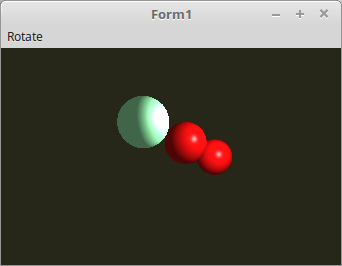

<html>
  
In diesem Beispiel wird gezeigt, was der <b>BindingPoint</b> für einen Einfluss hat. 
Es werden 3 Shader erzeugt, das es einfacher ist, habe ich 3mal die gleichen Shader-Sourcen genommen. 
Bei 2 Shadern werden die UBO-Daten mit dem <b>BindingPoint 0</b> verbunden, der einzelne Shader mit <b>BindingPoint</b> 1. 

 
Es werden drei UNOs angelegt. 
Die Uniform IDs werden füür jeden Shader einzeln ID gebraucht. 
Daher habe ich es in einem Record zusammengefasst. 
 
Man sieht auch, das 2 BindingPoints verwendet werden. 
<pre><code><b>var</b>
  UBO: <b>record</b>
    Rubin, Jade, Smaragdgruen: GLuint;        <i>// Puffer-Zeiger</i>
  <b>end</b>;

  ShaderData: <b>array</b>[0..2] <b>of</b> <b>record</b>
    Shader: TShader;
    Material_ID,
    ModelMatrix_ID,
    Matrix_ID: GLint;
  <b>end</b>;

  bindingPoint0: gluint = 0;
  bindingPoint1: gluint = 1;</code></pre>
Es werden 3 Shader geladen in die Uniform-IDs ausgelesen. 
<pre><code><b>procedure</b> TForm1.CreateScene;
<b>var</b>
  i: integer;
<b>begin</b>
  <b>for</b> i := 0 <b>to</b> 2 <b>do</b> <b>begin</b>
    <b>with</b> ShaderData[i] <b>do</b> <b>begin</b>
      Shader := TShader.Create([FileToStr('Vertexshader.glsl'), FileToStr('Fragmentshader.glsl')]);
      <b>with</b> Shader <b>do</b> <b>begin</b>
        UseProgram;
        Matrix_ID := UniformLocation('Matrix');
        ModelMatrix_ID := UniformLocation('ModelMatrix');

        Material_ID := UniformBlockIndex('Material'); <i>// ID aus dem Shader holen.</i>
      <b>end</b>;
    <b>end</b>;
  <b>end</b>;</code></pre>
Material-Daten in den UBO-Puffer laden und binden. 
 
Man sieht, das beim Shader[2] ein anderer BindingPoint verwendet wird. 
<pre><code><b>procedure</b> TForm1.InitScene;
<b>begin</b>
  <i>// Puffer für Rubin anlegen.</i>
  <b>with</b> Material <b>do</b> <b>begin</b>
    ambient := vec3(0.17, 0.01, 0.01);
    diffuse := vec3(0.61, 0.04, 0.04);
    specular := vec3(0.73, 0.63, 0.63);
    shininess := 76.8;
  <b>end</b>;
  glBindBuffer(GL_UNIFORM_BUFFER, UBO.Rubin);
  glBufferData(GL_UNIFORM_BUFFER, sizeof(TMaterial), @Material, GL_DYNAMIC_DRAW);

  <i>// Puffer für Jade anlegen.</i>
  <b>with</b> Material <b>do</b> <b>begin</b>
    ambient := vec3(0.14, 0.22, 0.16);
    diffuse := vec3(0.54, 0.89, 0.63);
    specular := vec3(0.32, 0.32, 0.32);
    shininess := 12.8;
  <b>end</b>;
  glBindBuffer(GL_UNIFORM_BUFFER, UBO.Jade);
  glBufferData(GL_UNIFORM_BUFFER, sizeof(TMaterial), @Material, GL_DYNAMIC_DRAW);

  <i>// Puffer für Smaragdgruen anlegen.</i>
  <b>with</b> Material <b>do</b> <b>begin</b>
    ambient := vec3(0.02, 0.17, 0.02);
    diffuse := vec3(0.08, 0.81, 0.08);
    specular := vec3(0.63, 0.73, 0.63);
    shininess := 76.8;
  <b>end</b>;
  glBindBuffer(GL_UNIFORM_BUFFER, UBO.Smaragdgruen);
  glBufferData(GL_UNIFORM_BUFFER, sizeof(TMaterial), @Material, GL_DYNAMIC_DRAW);

  <i>// Verbindung mit dem Shader aufbauen.</i>
  <b>with</b> ShaderData[0] <b>do</b> <b>begin</b>
    glUniformBlockBinding(Shader.ID, Material_ID, bindingPoint0);
  <b>end</b>;

  <b>with</b> ShaderData[1] <b>do</b> <b>begin</b>
    glUniformBlockBinding(Shader.ID, Material_ID, bindingPoint0);
  <b>end</b>;

  <b>with</b> ShaderData[2] <b>do</b> <b>begin</b>
    glUniformBlockBinding(Shader.ID, Material_ID, bindingPoint1);
  <b>end</b>;

  <i>// Die Puffer das erste mal binden.</i>
  <i>// Das sieht man, das der Shader[2] mit Jade gebunden wird.</i>
  glBindBufferBase(GL_UNIFORM_BUFFER, bindingPoint0, UBO.Rubin);
  glBindBufferBase(GL_UNIFORM_BUFFER, bindingPoint1, UBO.Jade);
</code></pre>
Die Scene wird drei mal mit unterschiedlichen Shadern gezeichnet. 
Um die UBO muss man da sich nicht kümmern, das diese mit dem BindingPoint gebunden sind. 
<pre><code><b>procedure</b> TForm1.ogcDrawScene(Sender: TObject);
<b>var</b>
  scal, d: single;
<b>begin</b>
  glClear(GL_COLOR_BUFFER_BIT <b>or</b> GL_DEPTH_BUFFER_BIT);  <i>// Frame und Tiefen-Buffer löschen.</i>

  glEnable(GL_CULL_FACE);
  glCullface(GL_BACK);

  glBindVertexArray(VBCube.VAO);

  d := 6.0;
  scal := 10;

  <i>// --- Zeichne Kugeln</i>

  <b>with</b> ShaderData[0] <b>do</b> <b>begin</b>
    Shader.UseProgram;

    Matrix.Identity;
    Matrix.Translate(d, d, d);
    Matrix.Scale(scal);
    Matrix := ModelMatrix * Matrix;

    Matrix.Uniform(ModelMatrix_ID);                        <i>// Erste Übergabe an den Shader.</i>

    Matrix := FrustumMatrix * WorldMatrix *  Matrix;       <i>// Matrizen multiplizieren.</i>

    Matrix.Uniform(Matrix_ID);
    glDrawArrays(GL_TRIANGLES, 0, Length(SphereVertex) * 3);
  <b>end</b>;

  <i>// --- Zeichne Kugeln</i>

  <b>with</b> ShaderData[1] <b>do</b> <b>begin</b>
    Shader.UseProgram;

    Matrix.Identity;
    Matrix.Translate(d + 30, d, d);
    Matrix.Scale(scal);
    Matrix := ModelMatrix * Matrix;

    Matrix.Uniform(ModelMatrix_ID);                        <i>// Erste Übergabe an den Shader.</i>

    Matrix := FrustumMatrix * WorldMatrix *  Matrix;       <i>// Matrizen multiplizieren.</i>

    Matrix.Uniform(Matrix_ID);
    glDrawArrays(GL_TRIANGLES, 0, Length(SphereVertex) * 3);
  <b>end</b>;

  <i>// --- Zeichne Kugeln</i>

  <b>with</b> ShaderData[2] <b>do</b> <b>begin</b>
    Shader.UseProgram;

    Matrix.Identity;
    Matrix.Translate(d - 30, d, d);
    Matrix.Scale(scal);
    Matrix := ModelMatrix * Matrix;

    Matrix.Uniform(ModelMatrix_ID);                        <i>// Erste Übergabe an den Shader.</i>

    Matrix := FrustumMatrix * WorldMatrix *  Matrix;       <i>// Matrizen multiplizieren.</i>

    Matrix.Uniform(Matrix_ID);
    glDrawArrays(GL_TRIANGLES, 0, Length(SphereVertex) * 3);
  <b>end</b>;

  ogc.SwapBuffers;
<b>end</b>;</code></pre>
Es wird nur der BindingPoint 0 geändert. 
Somit sit man beim <b>Shader[2]</b> der mit <b>BindingPoint 1</b> gebunden ist keine Änderung. 
<pre><code><b>procedure</b> TForm1.Timer2Timer(Sender: TObject);
<b>const</b>
  m: integer = 0;
<b>begin</b>
  <b>case</b> m <b>of</b>
    0: <b>begin</b>
      glBindBufferBase(GL_UNIFORM_BUFFER, bindingPoint0, UBO.Rubin);
    <b>end</b>;
    1: <b>begin</b>
      glBindBufferBase(GL_UNIFORM_BUFFER, bindingPoint0, UBO.Smaragdgruen);
    <b>end</b>;
  <b>end</b>;

  Inc(m);
  <b>if</b> m &gt; 1 <b>then</b> <b>begin</b>
    m := 0;
  <b>end</b>;
<b>end</b>;</code></pre>

 
Der Shader ist der selbe wie im ersten Beispiel. 
 
<b>Vertex-Shader:</b> 
<pre><code><b>#version</b> 330

<b>layout</b> (location = 0) <b>in</b> <b>vec3</b> inPos;    <i>// Vertex-Koordinaten</i>
<b>layout</b> (location = 1) <b>in</b> <b>vec3</b> inNormal; <i>// Normale</i>

<i>// Daten für Fragment-shader</i>
<b>out</b> Data {
  <b>vec3</b> Pos;
  <b>vec3</b> Normal;
} DataOut;

<i>// Matrix des Modeles, ohne Frustum-Beeinflussung.</i>
<b>uniform</b> <b>mat4</b> ModelMatrix;

<i>// Matrix für die Drehbewegung und Frustum.</i>
<b>uniform</b> <b>mat4</b> Matrix;

<b>void</b> main(<b>void</b>)
{
  gl_Position    = Matrix * <b>vec4</b>(inPos, 1.0);

  DataOut.Normal = <b>mat3</b>(ModelMatrix) * inNormal;
  DataOut.Pos    = (ModelMatrix * <b>vec4</b>(inPos, 1.0)).xyz;
}
</code></pre>

 
<b>Fragment-Shader</b> 
<pre><code><b>#version</b> 330

<i>// Licht</i>
<b>#define</b> Lposition  <b>vec3</b>(35.0, 17.5, 35.0)
<b>#define</b> Lambient   <b>vec3</b>(1.8, 1.8, 1.8)
<b>#define</b> Ldiffuse   <b>vec3</b>(1.5, 1.5, 1.5)

<i>// Daten vom Vertex-Shader</i>
<b>in</b> Data {
  <b>vec3</b> Pos;
  <b>vec3</b> Normal;
} DataIn;

<b>layout</b> (std140) <b>uniform</b> Material {
  <b>vec3</b>  Mambient;   <i>// Umgebungslicht</i>
  <b>vec3</b>  Mdiffuse;   <i>// Farbe</i>
  <b>vec3</b>  Mspecular;  <i>// Spiegelnd</i>
  <b>float</b> Mshininess; <i>// Glanz</i>
};

<b>out</b> <b>vec4</b> outColor;

<b>vec3</b> Light(<b>in</b> <b>vec3</b> p, <b>in</b> <b>vec3</b> n) {
  <b>vec3</b> nn = normalize(n);
  <b>vec3</b> np = normalize(p);
  <b>vec3</b> diffuse;   <i>// Licht</i>
  <b>vec3</b> specular;  <i>// Reflektion</i>
  <b>float</b> angele = max(dot(nn, np), 0.0);
  <b>if</b> (angele &gt; 0.0) {
    <b>vec3</b> eye = normalize(np + <b>vec3</b>(0.0, 0.0, 1.0));
    specular = pow(max(dot(eye, nn), 0.0), Mshininess) * Mspecular;
    diffuse  = angele * Mdiffuse * Ldiffuse;
  } <b>else</b> {
    specular = <b>vec3</b>(0.0);
    diffuse  = <b>vec3</b>(0.0);
  }
  <b>return</b> (Mambient * Lambient) + diffuse + specular;
}

<b>void</b> main(<b>void</b>)
{
  outColor = <b>vec4</b>(Light(Lposition - DataIn.Pos, DataIn.Normal), 1.0);
}

</code></pre>

</html>
