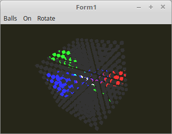

# 17 - Uniform Buffer Object (UBO)
## 20 - Mehrere UBOs in einem Shader

<br><br>
Es ist auch möglich, mehrere Unifom-Blöcke im Shader anzulegen.
Ein Uniform-Block wurde verwendet für die Matrizen.
Der andere für die Lichtparameter.

Hier sieht man auch gut wie einfach es ist, alle Parameter für die 3 Lampen in einem Rutsch dem Shader zu übergeben.
glUniform müsste man dazu zig mal aufrufen und wen man mehrere Shader verwendet, müsste man dies sogar bei jeden Shader einzeln machen.
<hr><br>
Die Deklaration der Lichtparameter und der Matrizen für den UBO.

```pascal
type
  TLight = record
    Uniform_ID,
    UBO: GLuint;
    bindingPoint: gluint;
    Data: array[0..2] of record
      On: boolean;
      CutOff: GLfloat;
      pad0: TVector2f;
      Pos: TVector3f;
      pad1: GLfloat;
      Color: TVector3f;
      pad2: GLfloat;
    end;
  end;

  TMatrixRec = record
    Uniform_ID,
    UBO: GLuint;
    bindingPoint: gluint;
    Data: record
      Model,
      World: TMatrix;
    end;
  end;

var
  Light: TLight;
  MatrixRec: TMatrixRec;
```

Die Lichtparameter mit Anfangswerten laden.

```pascal
procedure TForm1.CreateScene;
const
  LichtPositionRadius = 50.0;
var
  i: integer;
begin
  with Light do begin
    bindingPoint := 0;
    for i := 0 to 2 do begin
      with Data[i] do begin
        On := True;
        CutOff := cos(pi / 2 / 16);
        Color.FromInt($FF0000 shr (i * 8));
      end;
    end;

    with Data[0] do begin
      Pos := vec3(-1.0, 0.0, 0.0);
      Pos.Scale(LichtPositionRadius);
    end;

    with Data[1] do begin
      Pos := vec3(0.0, 1.0, 0.0);
      Pos.Scale(LichtPositionRadius);
    end;

    with Data[2] do begin
      Pos := vec3(1.0, 1.0, -1.0);
      Pos.Scale(LichtPositionRadius);
    end;
  end;
```

Für die beiden UBOs Speicher reservieren.

```pascal
procedure TForm1.InitScene;
begin
  with Light do begin
    // Speicher für UBO reservieren
    glBindBuffer(GL_UNIFORM_BUFFER, UBO);
    glBufferData(GL_UNIFORM_BUFFER, sizeof(Data), nil, GL_DYNAMIC_DRAW);

    // UBO mit dem Shader verbinden
    glUniformBlockBinding(Shader.ID, Uniform_ID, bindingPoint);
    glBindBufferBase(GL_UNIFORM_BUFFER, bindingPoint, UBO);
  end;

  with MatrixRec do begin
    bindingPoint := 3;

    // Speicher für UBO reservieren
    glBindBuffer(GL_UNIFORM_BUFFER, UBO);
    glBufferData(GL_UNIFORM_BUFFER, sizeof(Data), nil, GL_DYNAMIC_DRAW);

    // UBO mit dem Shader verbinden
    glUniformBlockBinding(Shader.ID, Uniform_ID, bindingPoint);
    glBindBufferBase(GL_UNIFORM_BUFFER, bindingPoint, UBO);
  end;
```

Hier sieht man gut, wie die UBO-Daten neu in den Puffer geladen werden.
Die Lichtparamter, werden über das Menü und dem Timer verändert.
Die Matrizen werden hier berechnet.

```pascal
procedure TForm1.ogcDrawScene(Sender: TObject);
var
  x, y, z: integer;
  scal, d: single;
begin
  glClear(GL_COLOR_BUFFER_BIT or GL_DEPTH_BUFFER_BIT);  // Frame und Tiefen-Buffer löschen.

  glEnable(GL_CULL_FACE);
  glCullface(GL_BACK);

  Shader.UseProgram;

  // --- Lichtparameter in UBO laden.
  with Light do begin
    glBindBuffer(GL_UNIFORM_BUFFER, UBO);
    glBufferSubData(GL_UNIFORM_BUFFER, 0, sizeof(Data), @Data);
  end;

  glBindVertexArray(VBCube.VAO);

  // --- Zeichne Würfel

  d := (7 / (CubeSize * 2 + 1)) * 8;

  if CubeSize &gt; 0 then begin
    scal := 40 / (CubeSize * 2 + 1);
  end else begin
    scal := 60;
  end;
  scal /= 2;

  for x := -CubeSize to CubeSize do begin
    for y := -CubeSize to CubeSize do begin
      for z := -CubeSize to CubeSize do begin
        with MatrixRec do begin
          // --- Matrixzen berechnen.
          with Data do begin
            Model.Identity;
            Model.Translate(x * d, y * d, z * d);
            Model.Scale(scal);
            Model := ModelMatrix * Model;

            World := Model;

            World := FrustumMatrix * WorldMatrix * World;
          end;

          // --- Matrixzen in UBO laden.
          glBindBuffer(GL_UNIFORM_BUFFER, UBO);
          glBufferSubData(GL_UNIFORM_BUFFER, 0, sizeof(Data), @Data);
        end;

        glDrawArrays(GL_TRIANGLES, 0, Length(CubeVertex) * 3); // Zeichnet einen kleinen Würfel.
      end;
    end;
  end;

  ogc.SwapBuffers;
end;
```

<hr><br>
Im Shader sieht man die beiden Uniform-Blöcke.
Für die Matrizen im Vertex-Shader, und für die Lichtparameter im Fragment-Shader.
Es dürfen auch mehrere Blöcke in einem Shader vorhanden sein.
<b>Vertex-Shader:</b>

```glsl
#version 330

layout (location = 0) in vec3 inPos;    // Vertex-Koordinaten

out Data {
  vec3 pos;
} DataOut;

// Matrizen zu einem Block zusammengefasst.
layout(std140) uniform Matrix {
  mat4 ModelMatrix;
  mat4 WorldMatrix;
} matrix;

void main(void)
{
  gl_Position  = matrix.WorldMatrix * vec4(inPos, 1.0);
  DataOut.pos  = (matrix.ModelMatrix * vec4(inPos, 1.0)).xyz;
}

```

<hr><br>
<b>Fragment-Shader:</b>

```glsl
#version 330

#define ambient vec3(0.2, 0.2, 0.2)

#define PI      3.1415

in Data {
  vec3 pos;
} DataIn;

// Struktur einer Lichtquelle.
struct  Light {
  bool  On;
  float CutOff;
  vec3  Pos;
  vec3  Color;
};

// Drei Lichtquellen in der Array.
layout(std140) uniform light0 {
  Light light[3];
};

out vec4 outColor;  // ausgegebene Farbe

// Berechnet die einzelnen Lichtquellen.
vec3 CalcLight(Light light) {

  vec3 lp = light.Pos;

  vec3 lightDirection = normalize(DataIn.pos - lp);
  vec3 spotDirection  = normalize(-light.Pos);

  float angle = dot(spotDirection, lightDirection);
  angle = max(angle, 0.0);

  if(angle &gt; light.CutOff) {
    return vec3(1.0);
  } else {
    return vec3(0.0);
  }
}

// In der Schleife werden alle Lichtquellen addieren.
void main(void)
{
  outColor = vec4(ambient, 1.0);

  for (int i = 0; i <= 2; i++) {
    if (light[i].On) {
      outColor.rgb += CalcLight(light[i]) * light[i].Color;
    }
  }
}


```


