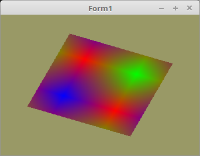

# 20 - Texturen
## 00 - Erste Textur



Mit Texturen sieht eine Mesh um einiges besser aus, als wen es nur einfache Farbverläufe sind.
Mit OpenGL kann man recht einfach Texturen in das VRAM laden.

Am einfachsten geht dies, wen man eine Textur als Statische Konstante hat, so wie im Beispiel hier.

In der Praxis wird man meistens Texturen von einer Bitmap-Datei laden.
Da es sehr viele Bitmap-Formate gibt, habe ich dafür eine Unit oglTextur.pas geschrieben.
Diese sollte die meisten üblichen Formate abdecken. Dazu später.
---
Das OpenGL weiss, welcher Bereich von einer Textur auf das Polygon gezeichnet wird, kommt noch eine 2D Vertex-Array dazu.
Hier im Beispiel, ist dies von einem Bereich von 0.0 bis 1.0, somit ist die ganze Textur sichtbar.
Als Versuch kann man die 1.0 durch 2.0 ersetzen, dann wird man sehen, das die Textur doppelt vorhanden ist.
Umgekehrt, mit 0.5 ist nur die halbe Textur sichtbar.
Natürlich kann man dies auch mit einer Matrix modfizieren, dazu später.

```pascal
const
  QuadVertex: array[0..5] of TVector3f =       // Koordinaten der Polygone.
    ((-0.8, -0.8, 0.0), (0.8, 0.8, 0.0), (-0.8, 0.8, 0.0),
    (-0.8, -0.8, 0.0), (0.8, -0.8, 0.0), (0.8, 0.8, 0.0));

  TextureVertex: array[0..5] of TVector2f =    // Textur-Koordinaten
    ((0.0, 0.0), (1.0, 1.0), (0.0, 1.0),
    (0.0, 0.0), (1.0, 0.0), (1.0, 1.0));
```

Die Textur selbst als Konstante. Es ist eine sehr kleine Textur mit 2x2 Pixel.
Das Format ist RGBA ( Rot/Grün/Blau/Alpha ).
Der Alpha-Kanal ist hier Bedeutungslos, er wird nur gebraucht, das ein Pixel auf 32Bit kommt.

Bei der Seitenlänge einer Textur sollt darauf geachtet werden, das diese <b>2<sup>x</sup></b> ist.
Andere Werte gehen zwar auch bei modernen OpenGL, aber dann muss mit Performanceeinbrüchen rechnen.

```pascal
const
  Textur32_0: packed array[0..1, 0..1, 0..3] of byte = ((($FF, $00, $00, $FF), ($00, $FF, $00, $FF)), (($00, $00, $FF, $FF), ($FF, $00, $00, $FF)));
```

Für die Textur-Koordinaten ist noch ein VBO dazu gekommen.

```pascal
type
  TVB = record
    VAO,
    VBOVertex,        // Vertex-Koordinaten
    VBOTex: GLuint;   // Textur-Koordianten
  end;

var
  VBQuad: TVB;
```

Wie in OpenGL üblich, braucht auch der Textur-Puffer eine ID.
Solche BPffer können auch mehrere vorkommen, eine Scene hat selten nur eine Textur.

```pascal
var
  textureID: GLuint;
```

Hier wird der Textur-Puffer mit <b>glGenTextures(...</b> erzeugt, ähnlich wie andere Puffer auch.
Für den Shader muss noch eine Sampler-Nr. zugeordnet werden, diese numeriert man fortlaufend durch.
Da man dies nur einmal machen muss, kann man den Umweg über eine Uniform_ID sparen und dies direkt verschachtelt zuweisen.
Ich hatte schon versucht, diese Nummer als Konstante in den Shader zu schreiben, dies geht aber leider <b>nicht</b> !

Da hier nur eine Textur verwendet wird, könnte man dies auch weglassen, weil dies default auf <b>0</b> ist.
Bei Multitexturing ist dies natürlich nicht mehr der Fall.

```pascal
procedure TForm1.CreateScene;
begin
  glGenVertexArrays(1, @VBQuad.VAO);
  glGenBuffers(1, @VBQuad.VBOVertex);
  glGenBuffers(1, @VBQuad.VBOTex);

  glGenTextures(1, @textureID);                 // Erzeugen des Textur-Puffer.

  Shader := TShader.Create([FileToStr('Vertexshader.glsl'), FileToStr('Fragmentshader.glsl')]);
  with Shader do begin
    UseProgram;
    Matrix_ID := UniformLocation('mat');
    glUniform1i(UniformLocation('Sampler'), 0);  // Dem Sampler 0 zuweisen.
  end;
```

Um Texturen zu laden, muss man die Textur zuerst binden, und anschliessend mit Daten füllen.
Das wichtigste dabei ist <b>glTexImage2D(...</b>. Hier gibt man eine Zeiger auf die Textur-Daten mit.
Die Textur-Daten im RAM könnte man anschliessend löschen, aber hier geht dies natürlich nicht, da es sich um eine Konstae handelt.
Dies wird erst interessant, wen man die Daten von der Festplatte lädt.
Da es sich um eine 2D-Texur handelt muss man über alll noch <b>GL_TEXTURE_2D</b> angeben.

```pascal
procedure TForm1.InitScene;
begin
  // Textur binden.
  glBindTexture(GL_TEXTURE_2D, textureID);

  // Textur laden.
  glTexImage2D(GL_TEXTURE_2D, 0, GL_RGBA, 2, 2, 0, GL_RGBA, GL_UNSIGNED_BYTE, @Textur32_0);

  // Ein minimalst Filter aktivieren, ansonsten bleibt die Ausgabe schwarz.
  glTexParameterf(GL_TEXTURE_2D, GL_TEXTURE_MIN_FILTER, GL_NEAREST);
//  glGenerateMipmap(GL_TEXTURE_2D);

  // Am Schluss kann man die Tetxur entbinden, dies ist aber nicht zwingend.
  glBindTexture(GL_TEXTURE_2D, 0);
```

Bevor man ein Polygon zeichnet, muss man die Texur binden. Dies geschieht mit <b>glBindTexture(...</b>.
Anschliessend kann ganz normal gezeichnet werden.

```pascal
procedure TForm1.ogcDrawScene(Sender: TObject);
begin
  glClear(GL_COLOR_BUFFER_BIT);

  glBindTexture(GL_TEXTURE_2D, textureID);  // Textur binden.
```

Zum Schluss muss man wie gewohnt, auch den Textur-Puffer wieder frei geben.

```pascal
procedure TForm1.FormDestroy(Sender: TObject);
begin
  Timer1.Enabled := False;

  glDeleteTextures(1, @textureID);       // Textur-Puffer frei geben.
  glDeleteVertexArrays(1, @VBQuad.VAO);
  glDeleteBuffers(1, @VBQuad.VBOVertex);
  glDeleteBuffers(1, @VBQuad.VBOTex);
```

---
<b>Vertex-Shader:</b>

Hier sieht man, das die Textur-Koordinaten gleich behandelt werden wie Vertex-Attribute.
Dies muss man dann aber dem Fragment-Shader weiterleiten. So wurde es auch schon mit den Color-Vectoren gemacht.

```glsl
#version 330

layout (location =  0) in vec3 inPos;   // Vertex-Koordinaten
layout (location = 10) in vec2 inUV;    // Textur-Koordinaten

uniform mat4 mat;

out vec2 UV0;

void main(void)
{
  gl_Position = mat * vec4(inPos, 1.0);
  UV0 = inUV;                           // Textur-Koordinaten weiterleiten.
}

```

---
<b>Fragment-Shader:</b>

Hier ist der Sampler für die Zuordnung dazu gekommen.
Und man sieht auch, das die Farb-Ausgabe von der Textur kommen.
Die UV-Koordinate gibt an, von welchem Bereich der Pixel aus der Textur gelesen wird.

```glsl
#version 330

in vec2 UV0;

uniform sampler2D Sampler;              // Der Sampler welchem 0 zugeordnet wird.

out vec4 FragColor;

void main()
{
  FragColor = texture( Sampler, UV0 );  // Die Farbe aus der Textur anhand der Koordinten auslesen.
}

```


