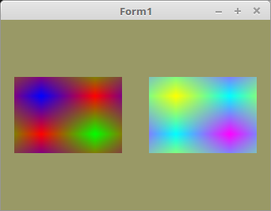

<!DOCTYPE html>
<html>
  <body bgcolor="#DDDDFF">
    <b><h1>20 - Texturen</h1></b>
    <b><h2>05 - Mehrere Texturen</h2></b>
  
Hier wird gezeigt, wie man mehrere Texturen laden kann, im Prinzip geht dies fast gleich wie bei einer Textur. 
In diesem Beispiel werden zwei Texturen geladen. 
 
Wichtig dabei ist, das man mit <b>glBindTexture(...</b> immer die richtige Textur bindet. 

 
Da es zwei Texturn hat, ist noch eine zweite Textur-Konstnate dazu gekommen. 
<pre><code>const
  Textur32_0: packed array[0..1, 0..1, 0..3] of byte = ((($FF, $00, $00, $FF), ($00, $FF, $00, $FF)), (($00, $00, $FF, $FF), ($FF, $00, $00, $FF)));
  Textur32_1: packed array[0..1, 0..1, 0..3] of byte = ((($00, $FF, $FF, $FF), ($FF, $00, $FF, $FF)), (($FF, $FF, $00, $FF), ($00, $FF, $FF, $FF)));</pre></code>
Da es zwei Texturen hat, bracuht es auch zwei IDs. 
<pre><code>var
  textureID: array[0..1] of GLuint;</pre></code>
Da die Zextur-IDs in einer Array sind, kann man die Textur-Puffer mit nur einem <b>glGenTextures(...</b> erzeugen. 
Dazu gebe ich als ersten Parameter die Länge der Array an. 
Natürlich könnte man die Puffer auch einzeln erzeugen. 
 
Das selbe könnte man auch bei den VAOs und VBOs machen. 
<pre><code>procedure TForm1.CreateScene;
begin
  glGenVertexArrays(1, @VBQuad.VAO);
  glGenBuffers(1, @VBQuad.VBOVertex);
  glGenBuffers(1, @VBQuad.VBOTex);

  glGenTextures(Length(textureID), @textureID);  // Erster Parameter die Länge der Arrray.</pre></code>
Mehrer Texturen laden geht genaus so einfache, wie wen man nur eine hat. 
<pre><code>procedure TForm1.InitScene;
begin
  // Textur 0 laden.
  glBindTexture(GL_TEXTURE_2D, textureID[0]);
  glTexImage2D(GL_TEXTURE_2D, 0, GL_RGBA, 2, 2, 0, GL_RGBA, GL_UNSIGNED_BYTE, @Textur32_0);
  glTexParameterf(GL_TEXTURE_2D, GL_TEXTURE_MIN_FILTER, GL_NEAREST);

  // Textur 1 laden.
  glBindTexture(GL_TEXTURE_2D, textureID[1]);
  glTexImage2D(GL_TEXTURE_2D, 0, GL_RGBA, 2, 2, 0, GL_RGBA, GL_UNSIGNED_BYTE, @Textur32_1);
  glTexParameterf(GL_TEXTURE_2D, GL_TEXTURE_MIN_FILTER, GL_NEAREST);

  glBindTexture(GL_TEXTURE_2D, 0);</pre></code>
Hier sieht man, das ich für die beiden Qudrate unterschiedliche Texturen binde. 
Koordinaten verwende ich für beide Qudrate die gleichen, einziger Unterschied, ich verschiebe die Matrix in unterschiedliche Richtungen. 
Aus diesem Grund wird die VAO auch nur einmal gebunden. 
<pre><code>procedure TForm1.ogcDrawScene(Sender: TObject);
begin
  glClear(GL_COLOR_BUFFER_BIT);
  Shader.UseProgram;

  glBindVertexArray(VBQuad.VAO);

  // Linkes Quadrat.
  glBindTexture(GL_TEXTURE_2D, textureID[0]);  // Textur 0 binden.
  ProdMatrix := ScaleMatrix;
  ProdMatrix.Translate(-0.5, 0.0, 0.0);
  ProdMatrix.Uniform(Matrix_ID);

  glDrawArrays(GL_TRIANGLES, 0, Length(QuadVertex));

  // Rechtes Quadrat.
  glBindTexture(GL_TEXTURE_2D, textureID[1]);  // Textur 1 binden.
  ProdMatrix := ScaleMatrix;
  ProdMatrix.Translate(0.5, 0.0, 0.0);
  ProdMatrix.Uniform(Matrix_ID);

  glDrawArrays(GL_TRIANGLES, 0, Length(QuadVertex));
  ogc.SwapBuffers;
end;</pre></code>
Logischerweise muss man auch wieder beide Textur-Puffer frei geben. 
<pre><code>procedure TForm1.FormDestroy(Sender: TObject);
begin
  glDeleteTextures(Length(textureID), @textureID); // Textur-Puffer frei geben.</pre></code>

 
Die Shader sind genau gleich, wie bei einer Textur. 
 
<b>Vertex-Shader:</b> 
 
<pre><code>#version 330

layout (location = 0) in vec3 inPos;    // Vertex-Koordinaten
layout (location = 10) in vec2 inUV;    // Textur-Koordinaten

uniform mat4 mat;

out vec2 UV0;

void main(void)
{
  gl_Position = mat * vec4(inPos, 1.0);
  UV0 = inUV;                           // Texur-Koordinaten weiterleiten.
}
</pre></code>

 
<b>Fragment-Shader:</b> 
 
<pre><code>#version 330

in vec2 UV0;

uniform sampler2D Sampler;              // Der Sampler welchem 0 zugeordnet wird.

out vec4 FragColor;

void main()
{
  FragColor = texture( Sampler, UV0 );  // Die Farbe aus der Textur anhand der Koordinaten auslesen.
}
</pre></code>

       
<h2><a href="../../index.html">zurück</a></h2>
  </body>
</html>
