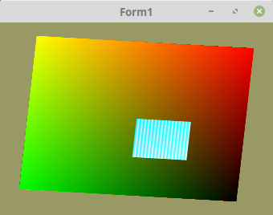

# 20 - Texturen
## 10 - Texturen austauschen, Auschnitt laden



Es ist möglich sehr schnell die Daten des Texturpuffers auszutauschen.
Dies ist auch mit einem **Texturauschnitt** möglich.
Dies geschieht mit **glTexSubImage2D(...**.

---
Big ist die Totalgrösse der Texturdaten.
Small ist ein Auschnitt.

```pascal
const
  TextursizeBig = 256;
  TextursizeSmall = 64;
```

3 Datenpuffer, welche sehr mit sehr einfachen Werten geladen werden.

```pascal
var
  TexturBig: packed array [0..TextursizeBig*TextursizeBig-1] of UInt32 ;
  TexturSmall0, TexturSmall1: packed array [0..TextursizeSmall*TextursizeSmall-1]of UInt32;
  textureID: GLuint;
```

Es werden sehr einfache Datenbuffer mit Daten befüllt.
In der Praxis werden die Puffer meistens mit Bitmaps gefüllt.
Der grosse Texturbuffer füllt die ganze Textur auf.
Die kleinen Datenbuffer werden später zur Laufzeit abwechslungsweise geladen.

```pascal
procedure TForm1.InitScene;
var
  i: integer;
begin
  // Einfache Datenbuffer erzeugen.
  for i := 0 to TextursizeBig * TextursizeBig - 1 do begin
    TexturBig[i] := i or $FF000000;
  end;

  for i := 0 to TextursizeSmall * TextursizeSmall - 1 do begin
    TexturSmall0[i] := i or $FF000000;
    TexturSmall1[i] := (not i) or $FF000000;
  end;

  // --- Texturbuffer erzeugen und anschliessend mit Daten der grossen Textur befüllen.

  glGenTextures(1, @textureID);
  glBindTexture(GL_TEXTURE_2D, textureID);

  // Nur Speicher reservieren
  glTexImage2D(GL_TEXTURE_2D, 0, GL_RGBA, TextursizeBig, TextursizeBig, 0, GL_RGBA, GL_UNSIGNED_BYTE, nil);

  // Texturbuffer mit dem grossen Datenbuffer befüllen.
  glTexSubImage2D(GL_TEXTURE_2D, 0, 0, 0, TextursizeBig, TextursizeBig, GL_RGBA, GL_UNSIGNED_BYTE, @TexturBig);
```

Ein Auschnitt der Textur wird zur Laufzeit abwechslungsweise ausgtauscht

```pascal
procedure TForm1.Timer1Timer(Sender: TObject);
const
  step = 0.01;
  z: integer = 1;
begin
  if z > 10 then begin
    glTexSubImage2D(GL_TEXTURE_2D, 0, 64, 64, TextursizeSmall, TextursizeSmall, GL_RGBA, GL_UNSIGNED_BYTE, @TexturSmall0);
  end else begin
    glTexSubImage2D(GL_TEXTURE_2D, 0, 64, 64, TextursizeSmall, TextursizeSmall, GL_RGBA, GL_UNSIGNED_BYTE, @TexturSmall1);
  end;
```


---
**Vertex-Shader:**

```glsl
#version 330

layout (location =  0) in vec3 inPos; // Vertex-Koordinaten
layout (location = 10) in vec2 inUV;  // Textur-Koordinaten
uniform mat4 mat;

out vec2 UV0;

void main(void)
{
  gl_Position = mat * vec4(inPos, 1.0);
  UV0         = inUV;
}

```


---
**Fragment-Shader:**

```glsl
#version 330

in vec2 UV0;

uniform sampler2D Sampler;

out vec4 FragColor;

void main()
{
  FragColor = texture( Sampler, UV0 );
}

```


