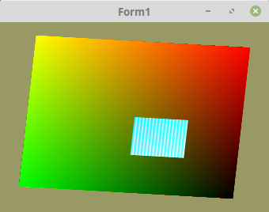

<!DOCTYPE html>
<html>
    <b><h1>20 - Texturen</h1></b>
    <b><h2>10 - Texturn austauschen, Auschnitt laden</h2></b>
  
Es ist möglich sehr schnell die Daten des Texturpuffers auszutauschen. 
Dies ist auch mit einem <b>Texturauschnitt</b> möglich. 
Dies geschieht mit <b>glTexSubImage2D(...</b>. 

 
Big ist die Totalgrösse der Texturdaten. 
Small ist ein Auschnitt. 
<pre><code><b>const</b>
  TextursizeBig = 256;
  TextursizeSmall = 64;</pre></code>
3 Datenpuffer, welche sehr mit sehr einfachen Werten geladen werden. 
<pre><code><b>var</b>
  TexturBig: <b>packed</b> <b>array</b> [0..TextursizeBig*TextursizeBig-1] <b>of</b> UInt32 ;
  TexturSmall0, TexturSmall1: <b>packed</b> <b>array</b> [0..TextursizeSmall*TextursizeSmall-1]<b>of</b> UInt32;
  textureID: GLuint;</pre></code>
Es werden sehr einfache Datenbuffer mit Daten befüllt. 
In der Praxis werden die Puffer meistens mit Bitmaps gefüllt. 
Der grosse Texturbuffer füllt die ganze Textur auf. 
Die kleinen Datenbuffer werden später zur Laufzeit abwechslungsweise geladen. 
<pre><code><b>procedure</b> TForm1.InitScene;
<b>var</b>
  i: integer;
<b>begin</b>
  <i>// Einfache Datenbuffer erzeugen.</i>
  <b>for</b> i := 0 <b>to</b> TextursizeBig * TextursizeBig - 1 <b>do</b> <b>begin</b>
    TexturBig[i] := i <b>or</b> $FF000000;
  <b>end</b>;

  <b>for</b> i := 0 <b>to</b> TextursizeSmall * TextursizeSmall - 1 <b>do</b> <b>begin</b>
    TexturSmall0[i] := i <b>or</b> $FF000000;
    TexturSmall1[i] := (<b>not</b> i) <b>or</b> $FF000000;
  <b>end</b>;

  <i>// --- Texturbuffer erzeugen und anschliessend mit Daten der grossen Textur befüllen.</i>

  glGenTextures(1, @textureID);
  glBindTexture(GL_TEXTURE_2D, textureID);

  <i>// Nur Speicher reservieren</i>
  glTexImage2D(GL_TEXTURE_2D, 0, GL_RGBA, TextursizeBig, TextursizeBig, 0, GL_RGBA, GL_UNSIGNED_BYTE, <b>nil</b>);

  <i>// Texturbuffer mit dem grossen Datenbuffer befüllen.</i>
  glTexSubImage2D(GL_TEXTURE_2D, 0, 0, 0, TextursizeBig, TextursizeBig, GL_RGBA, GL_UNSIGNED_BYTE, @TexturBig);</pre></code>
Ein Auschnitt der Textur wird zur Laufzeit abwechslungsweise ausgtauscht 
<pre><code><b>procedure</b> TForm1.Timer1Timer(Sender: TObject);
<b>const</b>
  step = 0.01;
  z: integer = 1;
<b>begin</b>
  <b>if</b> z > 10 <b>then</b> <b>begin</b>
    glTexSubImage2D(GL_TEXTURE_2D, 0, 64, 64, TextursizeSmall, TextursizeSmall, GL_RGBA, GL_UNSIGNED_BYTE, @TexturSmall0);
  <b>end</b> <b>else</b> <b>begin</b>
    glTexSubImage2D(GL_TEXTURE_2D, 0, 64, 64, TextursizeSmall, TextursizeSmall, GL_RGBA, GL_UNSIGNED_BYTE, @TexturSmall1);
  <b>end</b>;</pre></code>

 
<b>Vertex-Shader:</b> 
<pre><code><b>#version</b> 330

<b>layout</b> (location =  0) <b>in</b> <b>vec3</b> inPos; <i>// Vertex-Koordinaten</i>
<b>layout</b> (location = 10) <b>in</b> <b>vec2</b> inUV;  <i>// Textur-Koordinaten</i>
<b>uniform</b> <b>mat4</b> mat;

<b>out</b> <b>vec2</b> UV0;

<b>void</b> main(<b>void</b>)
{
  gl_Position = mat * <b>vec4</b>(inPos, 1.0);
  UV0         = inUV;
}
</pre></code>

 
<b>Fragment-Shader:</b> 
<pre><code><b>#version</b> 330

<b>in</b> <b>vec2</b> UV0;

<b>uniform</b> <b>sampler2D</b> Sampler;

<b>out</b> <b>vec4</b> FragColor;

<b>void</b> main()
{
  FragColor = texture( Sampler, UV0 );
}
</pre></code>

</html>
