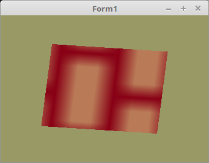

<html>
    <b><h1>20 - Texturen</h1></b>
    <b><h2>15 - Texturen von BMP</h2></b>
  
In der Praxis liegen die Texturen meisten als Bitmap, auf der Festplatte. 
Hier wird gezeigt, wie man eine 24Bit BMP als Textur lädt. 

 
Der Unterschied zur Konstante, das man die Bitmap noch laden muss, und anschliessend einen Zeiger darauf <b>glTexImage2D(...</b> mit gibt. 
Man kann auch eine Bitmap selbst über Canvas zeichnen. 
 
Das es sich hier um eine BMP-Datei handelt, kann man diese direkt mit <b>TBitmap</b> laden. 
 
Anstelle von TBitmap kann man auch TPicture verwenden. Was sehr wichtig ist, man muss wissen in welchen Format die Bitmap gespeichert ist. 
Je nach dem in welchen Format die Bitmap vorliegt, müssen die Parameter in <b>glTexImage2D(...</b> angepasst werden. 
In diesen Beispiel sind es die Konstanten <b>GL_RGB</b> und <b>GL_BGR</b>. 
 
Wen man eine Bitmap mit der Unit <b>oglTextur</b> lädt, werden diese Parameter automatisch angepasst. 
 
Unterumständen könnte es noch exotische Formate geben, welche (noch) nicht unterstützt werden. 
Bei einem Fehler bitte im DGL-Forum melden, evt. kann man es dann noch anpassen. ;-) 
<pre><code=pascal><b>procedure</b> TForm1.InitScene;
<b>var</b>
  bit: TBitmap;                  <i>// Bei anderen Formaten TPicture.</i>
<b>begin</b>
  bit := TBitmap.Create;         <i>// Bitmap erzeugen.</i>
  <b>with</b> bit <b>do</b> <b>begin</b>
    LoadFromFile('mauer.bmp');   <i>// BMP in Bitmap laden.</i>
 
    glBindTexture(GL_TEXTURE_2D, textureID);
    glTexImage2D(GL_TEXTURE_2D, 0, GL_RGB, Width, Height, 0, GL_BGR, GL_UNSIGNED_BYTE, RawImage.Data); <i>// Zeiger auf Bitmap übergeben.</i>
    glTexParameterf(GL_TEXTURE_2D, GL_TEXTURE_MIN_FILTER, GL_NEAREST);
    glBindTexture(GL_TEXTURE_2D, 0);
 
    Free;                        <i>// Bitmap frei geben.</i>
  <b>end</b>;</code></pre>

 
<b>Vertex-Shader:</b> 
<pre><code><b>#version</b> 330
 
<b>layout</b> (location =  0) <b>in</b> <b>vec3</b> inPos;   <i>// Vertex-Koordinaten</i>
<b>layout</b> (location = 10) <b>in</b> <b>vec2</b> inUV;    <i>// Textur-Koordinaten</i>
 
<b>uniform</b> <b>mat4</b> mat;
 
<b>out</b> <b>vec2</b> UV0;
 
<b>void</b> main(<b>void</b>)
{
  gl_Position = mat * <b>vec4</b>(inPos, 1.0);
  UV0 = inUV;                           <i>// Textur-Koordinaten weiterleiten.</i>
}
</code></pre>

 
<b>Fragment-Shader:</b> 
<pre><code><b>#version</b> 330
 
<b>in</b> <b>vec2</b> UV0;
 
<b>uniform</b> <b>sampler2D</b> Sampler;              <i>// Der Sampler welchem 0 zugeordnet wird.</i>
 
<b>out</b> <b>vec4</b> FragColor;
 
<b>void</b> main()
{
  FragColor = texture( Sampler, UV0 );  <i>// Die Farbe aus der Textur anhand der Koordinten auslesen.</i>
}
</code></pre>
 
</html>
