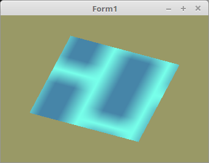

# 20 - Texturen
## 20 - Texturen mit oglTextur

<br><br>
Hier wird gezeigt, wie einfach es ist, mit der Unit <b>oglTextur</b> Texturen zu laden.
Dafür muss die Unit <b>oglTextur</b> bei uses eingebunden werden.

Mit der Klasse <b>TTexturBuffer</b> welche dort enthalten ist, geht dies sehr einfach.
Der grösste Voteil ist, das die meisten gängigen Formate von <b>TBitmap</b> erkannt werden.
<hr><br>
Den Textur-Puffer deklarieren.

```pascal
var
  Textur: TTexturBuffer;
```

Textur-Puffer erzeugen.

```pascal
procedure TForm1.CreateScene;
begin
  Textur := TTexturBuffer.Create;
```

Mit diesr Klasse geht das laden einer Bitmap sehr einfach.
Man kann die Texturen auch von einem <b>TRawImages</b> laden.

```pascal
procedure TForm1.InitScene;
begin
  Textur.LoadTextures('mauer.bmp');
```

Das Binden geht auch sehr einfach.
Man kann dieser Funktion noch eine Nummer mitgeben, aber diese wird nur bei Multitexturing gebraucht, dazu später.

```pascal
procedure TForm1.ogcDrawScene(Sender: TObject);
begin
  glClear(GL_COLOR_BUFFER_BIT);

  Textur.ActiveAndBind; // Textur binden
```

Am Ende muss man die Klasse noch frei geben.

```pascal
procedure TForm1.FormDestroy(Sender: TObject);
begin
  Textur.Free;
```

<hr><br>
<b>Vertex-Shader:</b>

```glsl
#version 330

layout (location = 0) in vec3 inPos;    // Vertex-Koordinaten
layout (location = 10) in vec2 inUV;    // Textur-Koordinaten

uniform mat4 mat;

out vec2 UV0;

void main(void)
{
  gl_Position = mat * vec4(inPos, 1.0);
  UV0 = inUV;                           // Textur-Koordinaten weiterleiten.
}

```

<hr><br>
<b>Fragment-Shader:</b>

```glsl
#version 330

in vec2 UV0;

uniform sampler2D Sampler;              // Der Sampler welchem 0 zugeordnet wird.

out vec4 FragColor;

void main()
{
  FragColor = texture( Sampler, UV0 );  // Die Farbe aus der Textur anhand der Koordinten auslesen.
}

```


