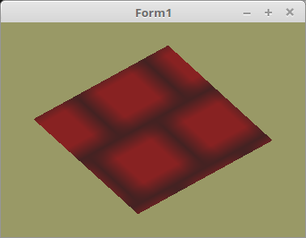

<!DOCTYPE html>
<html>
  <body bgcolor="#DDDDFF">
    <b><h1>20 - Texturen</h1></b>
    <b><h2>25 - Texturen von XPM</h2></b>
  
Für sehr einfache Texturen, ist das xpm-Format geeignet. Mit diesem kann man sehr schnell eine einfache Textur mit einem Text-Editor erstellen. 

 
Da etwas anderes als <b>BMP</b> geladen wird, muss anstelle von <b>TBitmap TPicture</b> verwendet werden. 
 
Momentan kann TPicture folgende Datei-Formate laden: <b>BMP, GIF, JPG, PCX, PNG, P?M, PDS, TGA, TIF, XPM, ICO, CUR, ICNS</b>. 
<pre><code>procedure TForm1.InitScene;
var
  pic: TPicture;
begin
  pic := TPicture.Create;                     // Picture erzeugen.
  with pic do begin
    LoadFromFile('mauer.xpm');                // XPM-Datei laden.
    Textur.LoadTextures(pic.Bitmap.RawImage); // Bitmap in VRAM laden.
    Free;                                     // Picture frei geben.
  end;</pre></code>

 
<b>Vertex-Shader:</b> 
<pre><code>#version 330

layout (location = 0) in vec3 inPos;    // Vertex-Koordinaten
layout (location = 10) in vec2 inUV;    // Textur-Koordinaten

uniform mat4 mat;

out vec2 UV0;

void main(void)
{
  gl_Position = mat * vec4(inPos, 1.0);
  UV0 = inUV;                           // Textur-Koordinaten weiterleiten.
}
</pre></code>

 
<b>Fragment-Shader:</b> 
<pre><code>#version 330

in vec2 UV0;

uniform sampler2D Sampler;              // Der Sampler welchem 0 zugeordnet wird.

out vec4 FragColor;

void main()
{
  FragColor = texture( Sampler, UV0 );  // Die Farbe aus der Textur anhand der Koordinten auslesen.
}
</pre></code>

 
<b>mauer.xpm:</b> 
<pre><code>/* XPM */
static char *XPM_mauer[] = {
  "8 8 2 1",
  "  c #882222",
  "* c #442222",
  "********",
  "*   *   ",
  "*   *   ",
  "*   *   ",
  "********",
  "  *   * ",
  "  *   * ",
  "  *   * "
};
</pre></code>

       
<h2><a href="../../index.html">zurück</a></h2>
  </body>
</html>
