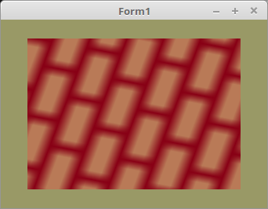

<!DOCTYPE html>
<html>
  <body bgcolor="#DDDDFF">
    <b><h1>20 - Texturen</h1></b>
    <b><h2>30 - Texturen und Matrixen</h2></b>
  
Die Textur-Koordinaten kann man im Shader auch mit einer Matrix multipizieren. 
Dies geschieht ähnlich, wie bei den Vertex-Koordinanten, der grösste Unterschied dabei ist, das es sich um 2D-Koordinaten handelt. 
 
Dabei ist zu beachten, das beim Drehen/Verschieben die Transformationen in umgekehrter Reihenfolge verläuft, 
im Gegensatz zu Vertex-Koordinaten. 

 
Das die Textur in der Mitte des Rechteckes dreht, muss sie um 0.5 verschoben werden. 
<pre><code><b>procedure</b> TForm1.CreateScene;
<b>begin</b>
  ScaleMatrix.Identity;
  ScaleMatrix.Scale(1.1);

  TexturRotMatrix.Identity;

  <i>// Textur verschieben</i>
  TexturTransMatrix.Identity;
  TexturTransMatrix.Translate(-0.5, -0.0);

  <i>// Startwerte Texturtransformation</i>
  <b>with</b> TexturTransform <b>do</b> <b>begin</b>
    scale := 1.0;
    direction := <b>True</b>;
  <b>end</b>;</pre></code>
Matrizen multiplizieren und den Shader übergeben. 
<pre><code><b>procedure</b> TForm1.ogcDrawScene(Sender: TObject);
<b>var</b>
  Matrix: TMatrix2D;
<b>begin</b>
  glClear(GL_COLOR_BUFFER_BIT);
  Textur.ActiveAndBind;
  Shader.UseProgram;

  ScaleMatrix.Uniform(Matrix_ID);  <i>// Matrix für die Vektoren.</i>

  <i>// --- Texturmatrizen multiplizieren und übergeben.</i>
  Matrix := TexturRotMatrix * TexturTransMatrix;
  Matrix.Uniform(texMatrix_ID);

  <i>// --- Zeichne Quadrat</i>
  glBindVertexArray(VBQuad.VAO);
  glDrawArrays(GL_TRIANGLES, 0, Length(QuadVertex));

  ogc.SwapBuffers;
<b>end</b>;</pre></code>
Berechnen der Matrix-Bewegungen. 
<pre><code><b>procedure</b> TForm1.Timer1Timer(Sender: TObject);
<b>const</b>
  sstep = 1.03;  <i>// Schritt für Skalierung</i>
  rstep = 0.01;  <i>// Schritt für Rotation</i>
  winkel: single = 0.0;

<b>begin</b>
  <b>with</b> TexturTransform <b>do</b> <b>begin</b>
    <b>if</b> direction <b>then</b> <b>begin</b>
      scale *= sstep;
      <b>if</b> scale > 15.0 <b>then</b> <b>begin</b>
        direction := <b>False</b>;
      <b>end</b>;
    <b>end</b> <b>else</b> <b>begin</b>
      scale /= sstep;
      <b>if</b> scale < 1.0 <b>then</b> <b>begin</b>
        direction := <b>True</b>;
      <b>end</b>;
    <b>end</b>;

    winkel := winkel + rstep;
    <b>if</b> winkel > 2 * pi <b>then</b> <b>begin</b>
      winkel := winkel - 2 * pi;
    <b>end</b>;

    <i>// Matrix Skalieren und Rotieren.</i>
    TexturRotMatrix.Identity;
    TexturRotMatrix.Scale(scale);
    TexturRotMatrix.Rotate(winkel);
  <b>end</b>;
  ogcDrawScene(Sender);
<b>end</b>;</pre></code>

 
Hier sieht man, wie die Texturkoordinaten anhand der Matrix manipuliert werden. 
 
<b>Vertex-Shader:</b> 
<pre><code><b>#version</b> 330

<b>layout</b> (location =  0) <b>in</b> <b>vec3</b> inPos;   <i>// Vertex-Koordinaten</i>
<b>layout</b> (location = 10) <b>in</b> <b>vec2</b> inUV;    <i>// Textur-Koordinaten</i>

<b>uniform</b> <b>mat4</b> mat;
<b>uniform</b> <b>mat3</b> texMat;

<b>out</b> <b>vec2</b> UV0;

<b>void</b> main(<b>void</b>)
{
  gl_Position = mat * <b>vec4</b>(inPos, 1.0);

  <i>// Texturkoordinaten transformieren</i>
  UV0 = (texMat * <b>vec3</b>(inUV, 1.0)).xy;
}
</pre></code>

 
<b>Fragment-Shader:</b> 
<pre><code><b>#version</b> 330

<b>in</b> <b>vec2</b> UV0;

<b>uniform</b> <b>sampler2D</b> Sampler;

<b>out</b> <b>vec4</b> FragColor;

<b>void</b> main()
{
  FragColor = texture( Sampler, UV0 );
}
</pre></code>

       
<h2><a href="../../index.html">zurück</a></h2>
  </body>
</html>
