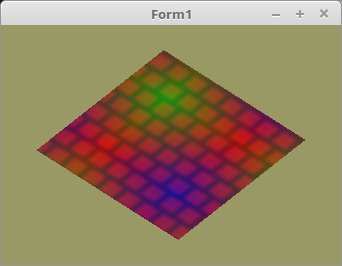

<!DOCTYPE html>
<html>
  <body bgcolor="#DDDDFF">
    <b><h1>20 - Texturen</h1></b>
    <b><h2>35 - Multitexturing</h2></b>
  
Multitexturing, tönt Anfangs sehr kompliziert, aber im Grunde ist es sehr einfach. 
Der Unterschied zu einer einzelnen Textur ist, das man mehrere Texturen über die Mesh zieht. 
Somit muss man auch mehrere Texturen beim Zeichenen mittels <b>glActiveTexture(...</b> aktivieren. 
 
Hier im Beispiel, ist es ein Stück Mauer, welches mit einer farbigen Lampe angeleuchtet wird. 

 
Die Textur-Puffer deklarieren, sehr einfach geht dies mit einer Array. 
<pre><code>var
  Textur: array [0..1] of TTexturBuffer;</pre></code>
Textur-Puffer erzeugen und Shader vorbereiten. 
Die Textur-Sampler muss man durchnummerieren. 
<pre><code>procedure TForm1.CreateScene;
begin
  Textur[0] := TTexturBuffer.Create;
  Textur[1] := TTexturBuffer.Create;

  Shader := TShader.Create([FileToStr('Vertexshader.glsl'), FileToStr('Fragmentshader.glsl')]);
  with Shader do begin
    UseProgram;
    Matrix_ID := UniformLocation('mat');
    glUniform1i(UniformLocation('Sampler[0]'), 0);  // Dem Sampler[0] 0 zuweisen.
    glUniform1i(UniformLocation('Sampler[1]'), 1);  // Dem Sampler[1] 1 zuweisen.
  end;</pre></code>
Mit diesr Klasse geht das laden einer Bitmap sehr einfach. 
Man kann die Texturen auch von einem <b>TRawImages</b> laden. 
<pre><code>procedure TForm1.InitScene;
begin
  Textur[0].LoadTextures('mauer.xpm');
  Textur[1].LoadTextures('licht.xpm');</pre></code>
Da man bei Multitexturing mehrere Sampler braucht, muss man mitteilen, welche Textur zu welchen Sampler gehört. 
Dies macht man mit <b>glActiveTexture(...</b>, Dazu muss man als Parameter die <b>Sampler-Nr + GL_TEXTURE0</b> mitgeben. 
 
Das sieht man auch gut in der TTexturBuffer Class. 
<pre><code>procedure TTexturBuffer.ActiveAndBind(Nr: integer);
begin
  glActiveTexture(GL_TEXTURE0 + Nr);
  glBindTexture(GL_TEXTURE_2D, FID);  // FID ist Textur-ID.
end;</pre></code>
 
<pre><code>procedure TForm1.ogcDrawScene(Sender: TObject);
begin
  glClear(GL_COLOR_BUFFER_BIT);

  Textur[0].ActiveAndBind(0); // Textur 0 mit Sampler 0 binden.
  Textur[1].ActiveAndBind(1); // Textur 1 mit Sampler 1 binden.</pre></code>
Die beiden Texturen am Ende wieder frei geben. 
<pre><code>procedure TForm1.FormDestroy(Sender: TObject);
begin
  Textur[0].Free;  // Texturen frei geben.
  Textur[1].Free;</pre></code>

 
<b>Vertex-Shader:</b> 
<pre><code>#version 330

layout (location = 0) in vec3 inPos;     // Vertex-Koordinaten
layout (location = 10) in vec2 inUV0;    // Textur-Koordinaten
layout (location = 11) in vec2 inUV1;    // Textur-Koordinaten

uniform mat4 mat;

out vec2 UV0;
out vec2 UV1;

void main(void)
{
  gl_Position = mat * vec4(inPos, 1.0);
  UV0 = inUV0;                           // Textur-Koordinaten weiterleiten.
  UV1 = inUV1;                           // Textur-Koordinaten weiterleiten.
}
</pre></code>

 
<b>Fragment-Shader:</b> 
 
Bei diesem einfachen Beispiel werden einfach die Pixel der Textur addiert und anschliessend duch 2 geteilt. 
<pre><code>#version 330

in vec2 UV0;
in vec2 UV1;

uniform sampler2D Sampler[2];                      // 2 Sampler deklarieren.

out vec4 FragColor;

void main()
{
  FragColor = (texture( Sampler[0], UV0 ) +        // Die beiden Farben zusammenzählen und anschliessend durch 2 teilen.
               texture( Sampler[1], UV1 )) / 2.0;
}
</pre></code>

 
<b>mauer.xpm:</b> 
<pre><code>/* XPM */
static char *XPM_mauer[] = {
  "8 8 2 1",
  "  c #AA2222",
  "* c #222222",
  "********",
  "*   *   ",
  "*   *   ",
  "*   *   ",
  "********",
  "  *   * ",
  "  *   * ",
  "  *   * "
};
</pre></code>

 
<b>licht.xpm:</b> 
<pre><code>/* XPM */
static char *XPM_licht[] = {
  "2 2 4 1",
  "1 c #FF0000",
  "2 c #00FF00",
  "3 c #0000FF",
  "4 c #FF0000",
  "12",
  "34"
};
</pre></code>

       
<h2><a href="../../index.html">zurück</a></h2>
  </body>
</html>
