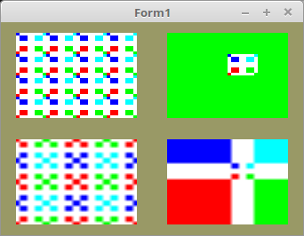

<html>
    <b><h1>20 - Texturen</h1></b>
    <b><h2>40 - Filter</h2></b>
  
Hier wird gezeigt, wie man Filter für Texturen verwenden kann. 
In diesem Beispiel wird nur eine Texturen geladen, aber es werden mehrere Filter verwendet. 
 
Die Filter verstellt man mit <b>glTexParameter(...</b>. 

 
Hier wird die Textur geladen und der Filter <b>MIN_FILTER</b> festgelegt, welcher für alle Ausgaben gültig ist. 
<pre><code=pascal><b>procedure</b> TForm1.InitScene;
<b>var</b>
  pic: TPicture;
 
<b>begin</b>
  pic := TPicture.Create;
  <b>with</b> pic <b>do</b> <b>begin</b>
    LoadFromFile('bild.xpm');
 
    <i>// Textur laden</i>
    glBindTexture(GL_TEXTURE_2D, textureID);
    glTexImage2D(GL_TEXTURE_2D, 0, GL_RGB8, Width, Height, 0, GL_BGR, GL_UNSIGNED_BYTE, Bitmap.RawImage.Data);
 
    <i>// Globaler Filter</i>
    glTexParameteri(GL_TEXTURE_2D, GL_TEXTURE_MIN_FILTER, GL_NEAREST);
 
    glBindTexture(GL_TEXTURE_2D, 0);
    Free;
  <b>end</b>;</code></pre>
Bei dem Filter <b>GL_CLAMP_TO_BORDER</b> kann man noch eine Hintergrundfarbe festlegen. 
<pre><code=pascal><b>procedure</b> TForm1.ogcDrawScene(Sender: TObject);
<i>// Hintergrundfarbe für Clamp_to_Border, ein Dunkelgrün.</i>
<b>const</b>
  border: <b>array</b>[0..3] <b>of</b> GLfloat = (0.0, 0.3, 0.0, 1.0);
<b>var</b>
  ProdMatrix: TMatrix;
<b>begin</b>
  glClear(GL_COLOR_BUFFER_BIT);
  Shader.UseProgram;
 
  glBindVertexArray(VBQuad.VAO);
  glBindTexture(GL_TEXTURE_2D, textureID);  <i>// Textur binden.</i>
 
  <i>// Links-Oben</i>
  glTexParameterf(GL_TEXTURE_2D, GL_TEXTURE_WRAP_S, GL_REPEAT);
  glTexParameterf(GL_TEXTURE_2D, GL_TEXTURE_WRAP_T, GL_REPEAT);
  glTexParameteri(GL_TEXTURE_2D, GL_TEXTURE_MAG_FILTER, GL_NEAREST);
 
  ProdMatrix := ScaleMatrix;
  ProdMatrix.Translate(-0.5, 0.5, 0.0);
  ProdMatrix.Uniform(Matrix_ID);
 
  glDrawArrays(GL_TRIANGLES, 0, Length(QuadVertex));
 
  <i>// Rechts-Oben</i>
  glTexParameterf(GL_TEXTURE_2D, GL_TEXTURE_WRAP_S, GL_CLAMP_TO_BORDER);
  glTexParameterf(GL_TEXTURE_2D, GL_TEXTURE_WRAP_T, GL_CLAMP_TO_BORDER);
  glTexParameteri(GL_TEXTURE_2D, GL_TEXTURE_MAG_FILTER, GL_NEAREST);
  glTexParameterfv(GL_TEXTURE_2D, GL_TEXTURE_BORDER_COLOR, @border);
 
  ProdMatrix := ScaleMatrix;
  ProdMatrix.Translate(0.5, 0.5, 0.0);
  ProdMatrix.Uniform(Matrix_ID);
 
  glDrawArrays(GL_TRIANGLES, 0, Length(QuadVertex));
 
  <i>// Links-Unten</i>
  glTexParameterf(GL_TEXTURE_2D, GL_TEXTURE_WRAP_S, GL_MIRRORED_REPEAT);
  glTexParameterf(GL_TEXTURE_2D, GL_TEXTURE_WRAP_T, GL_MIRRORED_REPEAT);
  glTexParameteri(GL_TEXTURE_2D, GL_TEXTURE_MAG_FILTER, GL_LINEAR);
 
  ProdMatrix := ScaleMatrix;
  ProdMatrix.Translate(-0.5, -0.5, 0.0);
  ProdMatrix.Uniform(Matrix_ID);
 
  glDrawArrays(GL_TRIANGLES, 0, Length(QuadVertex));
 
  <i>// Rechts-Unten</i>
  glTexParameterf(GL_TEXTURE_2D, GL_TEXTURE_WRAP_S, GL_CLAMP_TO_EDGE);
  glTexParameterf(GL_TEXTURE_2D, GL_TEXTURE_WRAP_T, GL_CLAMP_TO_EDGE);
  glTexParameteri(GL_TEXTURE_2D, GL_TEXTURE_MAG_FILTER, GL_LINEAR);
 
  ProdMatrix := ScaleMatrix;
  ProdMatrix.Translate(0.5, -0.5, 0.0);
  ProdMatrix.Uniform(Matrix_ID);
 
  glDrawArrays(GL_TRIANGLES, 0, Length(QuadVertex));
 
  ogc.SwapBuffers;
<b>end</b>;</code></pre>

 
<b>Vertex-Shader:</b> 
 
<pre><code><b>#version</b> 330
 
<b>layout</b> (location =  0) <b>in</b> <b>vec3</b> inPos;   <i>// Vertex-Koordinaten</i>
<b>layout</b> (location = 10) <b>in</b> <b>vec2</b> inUV;    <i>// Textur-Koordinaten</i>
 
<b>uniform</b> <b>mat4</b> mat;
 
<b>out</b> <b>vec2</b> UV0;
 
<b>void</b> main(<b>void</b>)
{
  gl_Position = mat * <b>vec4</b>(inPos, 1.0);
  UV0 = inUV;                           <i>// Texur-Koordinaten weiterleiten.</i>
}
</code></pre>

 
<b>Fragment-Shader:</b> 
 
<pre><code><b>#version</b> 330
 
<b>in</b> <b>vec2</b> UV0;
 
<b>uniform</b> <b>sampler2D</b> Sampler;
 
<b>out</b> <b>vec4</b> FragColor;
 
<b>void</b> main()
{
    FragColor = texture( Sampler, UV0 );
}
</code></pre>

 
<b>bild.xpm</b> 
 
<pre><code>/* XPM */
static char *XPM_mauer[] = {
  "8 8 6 1",
  "  c #882222",
  "* c #FFFFFF",
  "r c #FF0000",
  "g c #00FF00",
  "b c #0000FF",
  "y c #00FFFF",
  "r******g",
  "*rr**gg*",
  "*rr**gg*",
  "********",
  "********",
  "*bb**yy*",
  "*bb**yy*",
  "b******y"
};
</code></pre>
 
</html>
