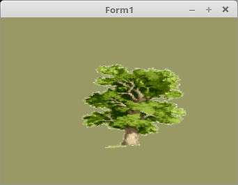

# 20 - Texturen
## 45 - Alpha-Textur



Texturen werden erst richtig interessant, wen noch der Alpha-Kanal verwendet wird.
Wie hier im Beispiel ein Baum.
<b>Hinweis:</b> Das Z-Bufferproblem, wie bei einfachen Alphablending muss bei Alphatexturen auch beachtet werden. Siehe [[Lazarus_-_OpenGL_3.3_Tutorial#Alpha_Blending|Alphablending]].
---
Wichtig ist, das man OpenGL mitteilt, das man Alpha-Blending will.

```pascal
procedure TForm1.InitScene;
begin
  Textur.LoadTextures('baum.png');
  glEnable(GL_BLEND);                                  // Alphablending an
  glBlendFunc(GL_SRC_ALPHA, GL_ONE_MINUS_SRC_ALPHA);   // Sortierung der Primitiven von hinten nach vorne.
```

---
Die Shader sehen gleich aus, wie bei einer einfachen Textur.

<b>Vertex-Shader:</b>

```glsl
#version 330

layout (location = 0) in vec3 inPos;    // Vertex-Koordinaten
layout (location = 10) in vec2 inUV;    // Textur-Koordinaten

uniform mat4 mat;

out vec2 UV0;

void main(void)
{
  gl_Position = mat * vec4(inPos, 1.0);
  UV0 = inUV;                           // Textur-Koordinaten weiterleiten.
}

```

---
<b>Fragment-Shader:</b>

```glsl
#version 330

in vec2 UV0;

uniform sampler2D Sampler;              // Der Sampler welchem 0 zugeordnet wird.

out vec4 FragColor;

void main()
{
  FragColor = texture( Sampler, UV0 );  // Die Farbe aus der Textur anhand der Koordinten auslesen.
}

```


