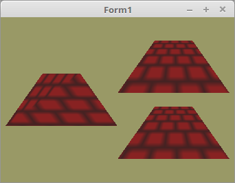

<html>
  
Stellt man eine Textur auf einem Trapez dar, gibt es unschöne Verzerrungen, das sieht man beim Trapez Links gut. 
Die beiden Trapeze Rechts sind korrigiert, auf 2 verschiedene Varianten. Der Unterschied sieht man im Shader. 

 
Es hat eine 2. Variante für die Textur-Koordinaten gegeben, welche einen Wert für eine Perspektivenkorrektur hat. 
Diese enthält einen Korrekturwert für die Perspektive. 
<pre><code><b>const</b>
  <i>// Koordinaten für Trapez.</i>
  TrapezeVertex: <b>array</b>[0..5] <b>of</b> TVector3f =
    ((-1.2, -0.8, 0.0), (0.4, 0.8, 0.0), (-0.4, 0.8, 0.0),
    (-1.2, -0.8, 0.0), (1.2, -0.8, 0.0), (0.4, 0.8, 0.0));

  <i>// Normale unkorrigierte Textur-Koordinaten.</i>
  TextureNormalVertex: <b>array</b>[0..5] <b>of</b> TVector2f =
    ((-1.0, -1.0), (1.0, 1.0), (-1.0, 1.0),
    (-1.0, -1.0), (1.0, -1.0), (1.0, 1.0));

  <i>// Textur-Koordinaten mit Perspektivenkorrektur.</i>
  TexturePerspVertex1: <b>array</b>[0..5] <b>of</b> TVector3f =
    ((-1.2, -0.8, 1.2), (0.4, 0.8, 0.4), (-0.4, 0.8, 0.4),
    (-1.2, -0.8, 1.2), (1.2, -0.8, 1.2), (0.4, 0.8, 0.4));</code></pre>
Vertex-Daten hochladen, dies ist nichts besonderes, ausser, das für die Perspektivenkorrigierte Variante auch ein Vec3 ist. 
<pre><code><b>procedure</b> TForm1.InitScene;
<b>var</b>
  pic: TPicture;
  i: integer;
<b>begin</b>
  glClearColor(0.6, 0.6, 0.4, 1.0);

  glBindVertexArray(VBO_Trapeze.VAO);

  <i>// Vektoren Trapez</i>
  glBindBuffer(GL_ARRAY_BUFFER, VBO_Trapeze.VBO.Vertex);
  glBufferData(GL_ARRAY_BUFFER, sizeof(TrapezeVertex), @TrapezeVertex, GL_STATIC_DRAW);
  glEnableVertexAttribArray(0);
  glVertexAttribPointer(0, 3, GL_FLOAT, <b>False</b>, 0, <b>nil</b>);

  <i>// Unkorrigierte Textur-Koordinaten</i>
  glBindBuffer(GL_ARRAY_BUFFER, VBO_Trapeze.VBO.Textur[0]);
  glBufferData(GL_ARRAY_BUFFER, sizeof(TextureNormalVertex), @TextureNormalVertex, GL_STATIC_DRAW);
  glEnableVertexAttribArray(10);
  glVertexAttribPointer(10, 2, GL_FLOAT, <b>False</b>, 0, <b>nil</b>);

  <i>// Perspektivenkorrigiert Variante</i>
  glBindBuffer(GL_ARRAY_BUFFER, VBO_Trapeze.VBO.Textur[1]);
  glBufferData(GL_ARRAY_BUFFER, sizeof(TexturePerspVertex1), @TexturePerspVertex1, GL_STATIC_DRAW);
  glEnableVertexAttribArray(11);
  glVertexAttribPointer(11, 3, GL_FLOAT, <b>False</b>, 0, <b>nil</b>);</code></pre>
Zeichnen der 3 verschiedenne Varianten. 
<pre><code><b>procedure</b> TForm1.ogcDrawScene(Sender: TObject);
<b>begin</b>
  glClear(GL_COLOR_BUFFER_BIT);
  Textur.ActiveAndBind;  <i>// Textur binden.</i>

  <i>// Zeichne Unkorrigiert (Links)</i>
  Shader.UseProgram;
  glUniform1i(Variante_ID, 0);
  TransMatrix.Identity;
  TransMatrix.Translate(-1.2, 0.0, 0.0);
  ProdMatrix := ScaleMatrix * TransMatrix;
  ProdMatrix.Uniform(Matrix_ID);

  glBindVertexArray(VBO_Trapeze.VAO);
  glDrawArrays(GL_TRIANGLES, 0, Length(TrapezeVertex));

  <i>// Zeichne korrigiert Variante 1 (Rechts Oben)</i>
  glUniform1i(Variante_ID, 1);
  TransMatrix.Identity;
  TransMatrix.Translate(1.2, 1.0, 0.0);
  ProdMatrix := ScaleMatrix * TransMatrix;
  ProdMatrix.Uniform(Matrix_ID);
  glDrawArrays(GL_TRIANGLES, 0, Length(TrapezeVertex));

  <i>// Zeichne korrigiert Variante 2 (Rechts Unten)</i>
  glUniform1i(Variante_ID, 2);
  TransMatrix.Identity;
  TransMatrix.Translate(1.2, -1.0, 0.0);
  ProdMatrix := ScaleMatrix * TransMatrix;
  ProdMatrix.Uniform(Matrix_ID);
  glDrawArrays(GL_TRIANGLES, 0, Length(TrapezeVertex));

  ogc.SwapBuffers;
<b>end</b>;</code></pre>

 
<b>Vertex-Shader:</b> 
<pre><code><b>#version</b> 330

<b>layout</b> (location =  0) <b>in</b> <b>vec3</b> inPos;    <i>// Vertex-Koordinaten</i>
<b>layout</b> (location = 10) <b>in</b> <b>vec2</b> inUV0;    <i>// Textur-Koordinaten</i>
<b>layout</b> (location = 11) <b>in</b> <b>vec3</b> inUV1;

<b>uniform</b> <b>mat4</b> mat;

<b>out</b> Data {
  <b>vec2</b> UV0;
  <b>vec3</b> UV1;
} DataOut;

<b>void</b> main(<b>void</b>)
{
  gl_Position = mat * <b>vec4</b>(inPos, 1.0);
  DataOut.UV0 = inUV0;
  DataOut.UV1 = inUV1;
}
</code></pre>

 
<b>Fragment-Shader:</b> 
<pre><code><b>#version</b> 330

<b>in</b> Data {
  <b>vec2</b> UV0;
  <b>vec3</b> UV1;
} DataIn;

<b>uniform</b> <b>sampler2D</b> Sampler; <i>// Textursampler</i>
<b>uniform</b> <b>int</b> variante;      <i>// Variante der Texturberechnung</i>

<b>out</b> <b>vec4</b> FragColor;

<b>void</b> main()
{
  <b>switch</b> (variante) {

    <i>// Unkorrigiert</i>
    <b>case</b> 0: FragColor = texture( Sampler, DataIn.UV0 );
            <b>break</b>;

    <i>// Korrigiert Variante 1</i>
    <b>case</b> 1: FragColor = texture( Sampler, DataIn.UV1.xy / DataIn.UV1.z );
            <b>break</b>;

    <i>// Korrigiert Variante 2</i>
    <b>case</b> 2: FragColor = texture2DProj( Sampler, DataIn.UV1 );
  }
}
</code></pre>

 
<b>mauer.xpm:</b> 
<pre><code>/* XPM */
static char *XPM_mauer[] = {
  "8 8 2 1",
  "  c #882222",
  "* c #442222",
  "********",
  "*   *   ",
  "*   *   ",
  "*   *   ",
  "********",
  "  *   * ",
  "  *   * ",
  "  *   * "
};
</code></pre>

</html>
