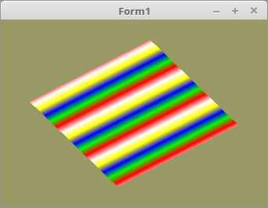

# 20 - Texturen
## 60 - 1D Textur



Die meisten Texturen sind eine Bitmap(Foto) welche im 2D-Format vorliegen.
Es gibt aber noch 1D und 3D-Texturen. Dieses Beispiel zeigt die Anwendung einer 1D-Textur.
Eine 1D-Textur kann man sich am besten als eine farbige Linie vorstellen.
---
Die Texturkoordinaten sind nun keine Vectorenarray mehr sondern nur eine einfache Float-Array.

```pascal
const
  QuadVertex: array[0..5] of TVector3f =       // Koordinaten der Polygone.
    ((-0.8, -0.8, 0.0), (0.8, 0.8, 0.0), (-0.8, 0.8, 0.0), (-0.8, -0.8, 0.0), (0.8, -0.8, 0.0), (0.8, 0.8, 0.0));

  TextureVertex: array[0..5] of GLfloat =
    (0.0, 3.0, 0.0, 0.0, 3.0, 3.0);
```

Eine Einfache 1D-Textur mit 5 Pixeln.

```pascal
const
  Textur24: packed array[0..4, 0..2] of byte =
    (($FF, $00, $00), ($00, $FF, $00), ($00, $00, $FF), ($FF, $FF, $00), ($FF, $FF, $FF));
```

Generieren des Texturbuffers.
Dies geschieht gleich wie bei der normalen 2D-Textur.

```pascal
procedure TForm1.CreateScene;
begin
  glGenTextures(1, @textureID);  // Erzeugen des Textur-Puffer.
```

Beim laden muss man bei den Textur-Befehlen beachten, das man <b>GL_TEXTURE_1D</b> nimmt.
Beim VertexAttribut wird für die Textur-Koordinaten nur eine Float-Array übergeben.

```pascal
procedure TForm1.InitScene;
begin
  // Textur binden.
  glBindTexture(GL_TEXTURE_1D, textureID);

  // Textur laden.
  glTexImage1D(GL_TEXTURE_1D, 0, GL_RGB, 5, 0, GL_RGB, GL_UNSIGNED_BYTE, @Textur24);

  // Ein minimalst Filter aktivieren, ansonsten bleibt die Ausgabe schwarz.
  glTexParameterf(GL_TEXTURE_1D, GL_TEXTURE_MIN_FILTER, GL_NEAREST);

  // Textur entbinden.
  glBindTexture(GL_TEXTURE_1D, 0);

  glClearColor(0.6, 0.6, 0.4, 1.0); // Hintergrundfarbe

  // Vektorkoordinaten
  glBindVertexArray(VBQuad.VAO);
  glBindBuffer(GL_ARRAY_BUFFER, VBQuad.VBOVertex);
  glBufferData(GL_ARRAY_BUFFER, sizeof(QuadVertex), @QuadVertex, GL_STATIC_DRAW);
  glEnableVertexAttribArray(0);
  glVertexAttribPointer(0, 3, GL_FLOAT, False, 0, nil);

  // Nur eine Float-Array
  glBindBuffer(GL_ARRAY_BUFFER, VBQuad.VBOTex);
  glBufferData(GL_ARRAY_BUFFER, sizeof(TextureVertex), @TextureVertex, GL_STATIC_DRAW);
  glEnableVertexAttribArray(10);
  glVertexAttribPointer(10, 1, GL_FLOAT, False, 0, nil);
end;
```

Das Zeichnen ist nichts besonderes.

```pascal
procedure TForm1.ogcDrawScene(Sender: TObject);
begin
  glClear(GL_COLOR_BUFFER_BIT);

  // Textur binden.
  glBindTexture(GL_TEXTURE_1D, textureID);

  Shader.UseProgram;

  ProdMatrix := ScaleMatrix * RotMatrix;
  ProdMatrix.Uniform(Matrix_ID);

  // Zeichne Quadrat
  glBindVertexArray(VBQuad.VAO);
  glDrawArrays(GL_TRIANGLES, 0, Length(QuadVertex));

  ogc.SwapBuffers;
end;
```

---
<b>Vertex-Shader:</b>

Man beachte, das die UV-Koordinaten nur ein <b>Float</b> ist.

```glsl
#version 330

layout (location =  0) in vec3  inPos;   // Vertex-Koordinaten
layout (location = 10) in float inUV;    // Textur-Koordinaten als Float-Array

uniform mat4 mat;

out float UV0;

void main(void)
{
  gl_Position = mat * vec4(inPos, 1.0);
  UV0 = inUV;                           // Textur-Koordinaten weiterleiten.
}

```

---
<b>Fragment-Shader:</b>

```glsl
#version 330

in float UV0;

uniform sampler1D Sampler;              // Ein 1D-Sampler

out vec4 FragColor;

void main()
{
  FragColor = texture( Sampler, UV0 );  // UV0 ist nur ein Float.
}

```


