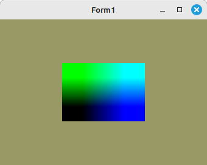

# 20 - Texturen
## 62 - 3D Textur



Ein Einfache Anwendung eine 3D-Textur

Normalerweise wäre die Textur-Vertex eine vec3 Konstante.
Ab da im Beispiel die W-Achse zur Laufzeit geändert wird, wir sie da ingnoriert.

---

```pascal
const
  QuadVertex0: array[0..5] of TVector3f =
    ((-0.8, -0.8, 0.0), (0.8, 0.8, 0.0), (-0.8, 0.8, 0.0),
    (-0.8, -0.8, 0.0), (0.8, -0.8, 0.0), (0.8, 0.8, 0.0));

  TextureVertex0: array[0..5] of TVector2f =
    ((0.0, 0.0), (1.0, 1.0), (0.0, 1.0),
    (0.0, 0.0), (1.0, 0.0), (1.0, 1.0));

const
  // Ebene 0
  Textur32_0: array of array[0..3] of byte = (
    ($00, $00, $00, $FF), ($00, $00, $FF, $FF), ($00, $FF, $00, $FF), ($00, $FF, $FF, $FF));
  // Ebene 1
  Textur32_1: array of array[0..3] of byte = (
    ($FF, $00, $00, $FF), ($FF, $00, $FF, $FF), ($FF, $FF, $00, $FF), ($FF, $FF, $FF, $FF));

var
  VAO, VBOVertex, VBOTex: GLuint;
  UBO: TGLuint;
  ProdMatrix: TMatrix;

  UBOBuffer: record
    mat: Tmat4x4;
    W: TGLfloat;  // W-Koordinate
      end;

```


```pascal
const
  QuadVertex0: array[0..5] of TVector3f =
    ((-0.8, -0.8, 0.0), (0.8, 0.8, 0.0), (-0.8, 0.8, 0.0),
    (-0.8, -0.8, 0.0), (0.8, -0.8, 0.0), (0.8, 0.8, 0.0));

  TextureVertex0: array[0..5] of TVector2f =
    ((0.0, 0.0), (1.0, 1.0), (0.0, 1.0),
    (0.0, 0.0), (1.0, 0.0), (1.0, 1.0));

const
  // Ebene 0
  Textur32_0: array of array[0..3] of byte = (
    ($00, $00, $00, $FF), ($00, $00, $FF, $FF), ($00, $FF, $00, $FF), ($00, $FF, $FF, $FF));
  // Ebene 1
  Textur32_1: array of array[0..3] of byte = (
    ($FF, $00, $00, $FF), ($FF, $00, $FF, $FF), ($FF, $FF, $00, $FF), ($FF, $FF, $FF, $FF));

var
  VAO, VBOVertex, VBOTex: GLuint;
  UBO: TGLuint;
  ProdMatrix: TMatrix;

  UBOBuffer: record
    mat: Tmat4x4;
    W: TGLfloat;  // W-Koordinate
      end;

```


---
**Vertex-Shader:**


```glsl
#version 330

layout (location = 0) in vec3 inPos;
layout (location = 1) in vec2 inUV;

layout (std140) uniform UBO {
  mat4x4 mat;
  float W;
};

out vec2 UV;

void main(void)
{
  gl_Position = mat * vec4(inPos, 1.0);
  UV = inUV;
}

```


---
**Fragment-Shader:**


```glsl
#version 330

in vec2 UV;

uniform sampler3D Sampler;

layout (std140) uniform UBO {
  mat4x4 mat;
  float W;  //
};

out vec4 FragColor;

void main()
{
  FragColor = texture( Sampler, vec3(UV, W));
}

```


