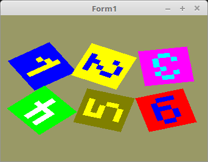

<!DOCTYPE html>
<html>
  <body bgcolor="#DDDDFF">
    <b><h1>20 - Texturen</h1></b>
    <b><h2>65 - Textur Array</h2></b>
  
Wen man mehrere Texturen im gleichen Format hat, kann man diese in einem einzigen Puffer ablegen. 
Dafür gibt es <b>GL_TEXTURE_2D_ARRAY</b>. 
Inerhalb des Puffers, sind die Texturen in mehreren Ebenen/Layer gespeichert. 
Zur Laufzeit muss man nur mit teilen, welche Layer das verwendet werden soll. Dies geschieht über eine Uniform-Variable. 
 
Eine Textur-Array kann man auch für Multitexturing verwenden. Man muss im Fragment-Shader nur bei <b>texture(...</b> nur den Layer angeben. 
Eine andere Anwendung wäre, bei einem 2D-Spiel, Sprites in eine Textur-Array abzulegen. 

 
Die Koordinaten sind gleich, wie bei einer einzelnen Textur. 
<pre><code>const
  QuadVertex: array[0..5] of TVector3f =       // Koordinaten der Polygone.
    ((-1.0, -1.0, 0.0), (1.0, 1.0, 0.0), (-1.0, 1.0, 0.0),
    (-1.0, -1.0, 0.0), (1.0, -1.0, 0.0), (1.0, 1.0, 0.0));

  TextureVertex: array[0..5] of TVector2f =    // Textur-Koordinaten
    ((0.0, 0.0), (1.0, 1.0), (0.0, 1.0),
    (0.0, 0.0), (1.0, 0.0), (1.0, 1.0));</pre></code>
Dieser Puffer wird gleich reserviert, wie bei der einzelnen Textur. 
Im Shader ist der Layer eine Unifom-Variable. 
<pre><code>procedure TForm1.CreateScene;
begin
  glGenTextures(1, @textureID);                 // Erzeugen des Textur-Puffer.

  Shader := TShader.Create([FileToStr('Vertexshader.glsl'), FileToStr('Fragmentshader.glsl')]);
  with Shader do begin
    UseProgram;
    Matrix_ID := UniformLocation('mat');
    Layer_ID := UniformLocation('Layer');        // Die ID für den Layer Zugriff.
    glUniform1i(UniformLocation('Sampler'), 0);  // Dem Sampler 0 zuweisen.
  end;

  glGenVertexArrays(1, @VBQuad.VAO);
  glGenBuffers(1, @VBQuad.VBOVertex);
  glGenBuffers(1, @VBQuad.VBOTex);</pre></code>
Die Ziffern befinde sich alle in einer Bitmap, welche alle Ziffern übereinander beinhaltet. 
Man sieht hier gut, das man anstelle von <b>GL_TEXTURE_2D</b>, <b>GL_TEXTURE_2D_ARRAY</b> verwenden muss. 
Die Textur-Daten werden mit <b>glTexImage3D(GL_TEXTURE_2D_ARRAY,...</b> übegeben. Neben der Breite und Höhe, muss man noch die Anzahl Layer mitgeben. 
Die Höhe muss man noch durch die Anzahl Layer teilen. 
<pre><code>procedure TForm1.InitScene;
const
  anzLayer = 6;
var
  bit: TPicture;                  // Bitmap
begin
  bit := TPicture.Create;
  with bit do begin
    LoadFromFile('ziffer.xpm');   // Das Images laden.

    glBindTexture(GL_TEXTURE_2D_ARRAY, textureID);

    glTexImage3D(GL_TEXTURE_2D_ARRAY, 0, GL_RGB, Width, Height div anzLayer, anzLayer, 0, GL_BGR, GL_UNSIGNED_BYTE, Bitmap.RawImage.Data);

    glTexParameteri(GL_TEXTURE_2D_ARRAY, GL_TEXTURE_MIN_FILTER, GL_NEAREST);
    glTexParameteri(GL_TEXTURE_2D_ARRAY, GL_TEXTURE_MAG_FILTER, GL_NEAREST);

    glBindTexture(GL_TEXTURE_2D_ARRAY, 0);
    Free;                        // Bitmap frei geben.
  end;</pre></code>
Zeichnen der einzelnen Quadrate. Hier sieht man gut, das nur eine Textur gebunden wird. 
Für den Textur-Wechsel muss man nur den Layer übergeben. 
Die Matrizen drehen und positionieren nur die Quadrate. 
<pre><code>procedure TForm1.ogcDrawScene(Sender: TObject);
var
  x, y: integer;
  Matrix: TMatrix;
begin
  glClear(GL_COLOR_BUFFER_BIT);

  Shader.UseProgram;
  glBindTexture(GL_TEXTURE_2D_ARRAY, textureID);  // Textur binden.
  glBindVertexArray(VBQuad.VAO);

  for x := 0 to 2 do begin
    for y := 0 to 1 do begin
      Matrix.Identity;
      Matrix.RotateC(x + y * 3 + 1);
      Matrix.Scale(0.4);
      Matrix.Translate(-1.0 + x, -0.5 + y, 0.0);
      Matrix := ScaleMatrix * Matrix;
      Matrix.Uniform(Matrix_ID);

      glUniform1i(Layer_ID, x + y * 3);    // Layer wechseln

      glDrawArrays(GL_TRIANGLES, 0, Length(QuadVertex));
    end;
  end;</pre></code>

 
Im Fragment-Shader muss ein 2D-Array-Sampler verwendet werden. 
Dieser hat ein 3. Parameter, welcher den Layer enthält. 
Ansonsten ist der Shader sehr einfach. 
 
<b>Vertex-Shader:</b> 
<pre><code>#version 330

layout (location =  0) in vec3 inPos;   // Vertex-Koordinaten
layout (location = 10) in vec2 inUV;    // Textur-Koordinaten

uniform mat4 mat;

out vec2 UV0;

void main(void)
{
  gl_Position = mat * vec4(inPos, 1.0);
  UV0 = inUV;                           // Textur-Koordinaten weiterleiten.
}
</pre></code>

 
<b>Fragment-Shader:</b> 
<pre><code>#version 330

in vec2 UV0;

uniform sampler2DArray Sampler;
uniform int            Layer;

out vec4 FragColor;

void main()
{
  FragColor = texture( Sampler, vec3(UV0, Layer));
}
</pre></code>
<b>ziffer.xpm:</b> 
<pre><code>/* XPM */
static char *ziffer_xpm[] = {

  /* width height num_colors chars_per_pixel */
  "     8    48       16            1",

  /* colors */
  "` c #000000", ". c #800000", "# c #008000", "a c #808000",
  "b c #000080", "c c #800080", "d c #008080", "e c #808080",
  "f c #c0c0c0", "g c #ff0000", "h c #00ff00", "i c #ffff00",
  "j c #0000ff", "k c #ff00ff", "l c #00ffff", "m c #ffffff",

  /* pixels */
  "jjjjjjjj", "jjjjijjj", "jjjiijjj", "jjijijjj", "jjjjijjj", "jjjjijjj", "jjjjijjj", "jjjjjjjj",
  "iiiiiiii", "iiijjiii", "iijiijii", "iiiiijii", "iiiijiii", "iiijiiii", "iijjjjii", "iiiiiiii",
  "kkkkkkkk", "kkkllkkk", "kklkklkk", "kkkklkkk", "kkkkklkk", "kklkklkk", "kkkllkkk", "kkkkkkkk",
  "hhhhhhhh", "hhmhmhhh", "hhmhmhhh", "hhmhmhhh", "hhmmmmhh", "hhhhmhhh", "hhhhmhhh", "hhhhhhhh",
  "aaaaaaaa", "aaiiiiaa", "aaiaaaaa", "aaiiiaaa", "aaaaaiaa", "aaaaaiaa", "aaiiiaaa", "aaaaaaaa",
  "gggggggg", "gggjjjgg", "ggjggggg", "ggjjjggg", "ggjggjgg", "ggjggjgg", "gggjjggg", "gggggggg"
};
</pre></code>

       
<h2><a href="../../index.html">zurück</a></h2>
  </body>
</html>
