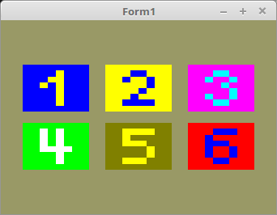

<html>
  
Man kann auch in jedem Layer einzeln die Texturen laden. 
Der einzige Unterschied zum kompletten laden ist, man ladet die Texturen einzeln mit SubImage hoch. 
Der Rest ist gleich, wie wen man alles miteinander hoch ladet. 

 
Mit <b>glTexImage3D(...</b> wird nur der Speicher für die Texturen reserviert. Dabei muss man von Anfang an wissen, wie gross die Texturen sind. 
Mit <b>glTexSubImage3D(...</b> werden dann die Texturen Layer für Layer hochgeladen. 
Die sechs einzelnen Bitmap heisen 1.xpm - 6.xpm . 
<pre><code><b>procedure</b> TForm1.InitScene;
<b>const</b>
  size = 8;      <i>// Grösse der Texturen</i>
  anzLayer = 6;
<b>var</b>
  i: integer;
  bit: TPicture; <i>// Bitmap</i>
<b>begin</b>
  bit := TPicture.Create;
  <b>with</b> bit <b>do</b> <b>begin</b>

    glBindTexture(GL_TEXTURE_2D_ARRAY, textureID);

    <i>// Speicher reservieren</i>
    glTexImage3D(GL_TEXTURE_2D_ARRAY, 0, GL_RGB, size, size, anzLayer, 0, GL_BGR, GL_UNSIGNED_BYTE, <b>nil</b>);
    glTexParameteri(GL_TEXTURE_2D_ARRAY, GL_TEXTURE_MIN_FILTER, GL_NEAREST);
    glTexParameteri(GL_TEXTURE_2D_ARRAY, GL_TEXTURE_MAG_FILTER, GL_NEAREST);
    <b>for</b> i := 0 <b>to</b> anzLayer - 1 <b>do</b> <b>begin</b>

      <i>// Bitmap von HD laden.</i>
      LoadFromFile(IntToStr(i + 1) + '.xpm');   <i>// Die Images laden.</i>

      <i>// Texturen hoch laden</i>
      glTexSubImage3D(GL_TEXTURE_2D_ARRAY, 0, 0, 0, i, Width, Height, 1, GL_BGR, GL_UNSIGNED_BYTE, Bitmap.RawImage.Data);
    <b>end</b>;
    glBindTexture(GL_TEXTURE_2D_ARRAY, 0);
    Free; <i>// Picture frei geben.</i>
  <b>end</b>;</code></pre>

 
Die Shader sind gleich, wie wen man alles auf einmal hoch ladet. 
 
<b>Vertex-Shader:</b> 
<pre><code><b>#version</b> 330

<b>layout</b> (location =  0) <b>in</b> <b>vec3</b> inPos;   <i>// Vertex-Koordinaten</i>
<b>layout</b> (location = 10) <b>in</b> <b>vec2</b> inUV;    <i>// Textur-Koordinaten</i>

<b>uniform</b> <b>mat4</b> mat;

<b>out</b> <b>vec2</b> UV0;

<b>void</b> main(<b>void</b>)
{
  gl_Position = mat * <b>vec4</b>(inPos, 1.0);
  UV0 = inUV;                           <i>// Textur-Koordinaten weiterleiten.</i>
}
</code></pre>

 
<b>Fragment-Shader:</b> 
<pre><code><b>#version</b> 330

<b>in</b> <b>vec2</b> UV0;

<b>uniform</b> <b>sampler2DArray</b> Sampler;
<b>uniform</b> <b>int</b>            Layer;

<b>out</b> <b>vec4</b> FragColor;

<b>void</b> main()
{
  FragColor = texture( Sampler, <b>vec3</b>(UV0, Layer));
}
</code></pre>

</html>
