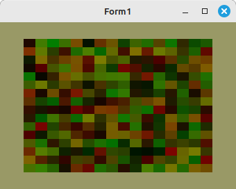

# 20 - Texturen
## 75 - Pixel Buffer Object PBO




---
Pixel Buffer Object (PBO)

---
**Vertex-Shader:**

```glsl
#version 330

layout (location =  0) in vec3 inPos;
layout (location =  1) in vec2 inUV;

out vec2 UV0;

void main(void)
{
  gl_Position = vec4(inPos, 1.0);
  UV0 = inUV;
}

```


---
**Fragment-Shader:**

```glsl
#version 330

in vec2 UV0;

uniform sampler2D Sampler0;
uniform sampler2D Sampler1;

out vec4 FragColor;

void main()
{
  FragColor = (texture( Sampler0, UV0 ) + texture( Sampler1, UV0 )) / 2;
}

```


