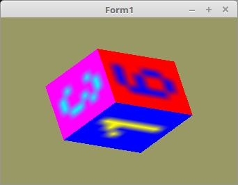

    <b><h1>22 - Cubemap Texturen</h1></b>
    <b><h2>00 - Wuerfel</h2></b>
  
Mit <b>Textur Cube Map</b> hat man die Möglichkeit die Texturen auf einer Würfel-Fläche abzubilden. 
Ausser für den einfachen Würfel kann man dies auch für folgendes gebrauchen. 
* Hintergrund in einer 360° Optik. 
* Reflektionen auf einer Mesh. 
Man kann auch eine Kugel oder sonst eine komplizierte Mesh nehmen. 
 
Die Textur-Koordinaten sind 3D-Vektoren, welche auf die Position des Würfels zeigen, 
dabei ist nur die Richtung des Vektores wichtig, die Länge ist egal. 
 
Meistens sind Vertex und Texturkoordinaten gleich. Hier im Beispiel ein Würfel. 

 
Die 6 Flächen des Würfels werden einzeln in VRAM geladen. 
Dies geschieht ähnlich, wie bei einer Textur-Array. 
 
Die sechs einelnen Bitmap heisen 1.xpm - 6.xpm . 
<pre><code><b>procedure</b> TForm1.InitScene;
<b>var</b>
  bit: TPicture; <i>// Bitmap</i>
<b>begin</b>
  bit := TPicture.Create;
  <b>with</b> bit <b>do</b> <b>begin</b>
    glBindTexture(GL_TEXTURE_2D_ARRAY, textureID);

    LoadFromFile('1.xpm');
    glTexImage2D(GL_TEXTURE_CUBE_MAP_POSITIVE_X, 0, GL_RGB, Width, Height, 0, GL_BGR, GL_UNSIGNED_BYTE, Bitmap.RawImage.Data);
    LoadFromFile('2.xpm');
    glTexImage2D(GL_TEXTURE_CUBE_MAP_NEGATIVE_X, 0, GL_RGB, Width, Height, 0, GL_BGR, GL_UNSIGNED_BYTE, Bitmap.RawImage.Data);
    LoadFromFile('3.xpm');
    glTexImage2D(GL_TEXTURE_CUBE_MAP_POSITIVE_Y, 0, GL_RGB, Width, Height, 0, GL_BGR, GL_UNSIGNED_BYTE, Bitmap.RawImage.Data);
    LoadFromFile('4.xpm');
    glTexImage2D(GL_TEXTURE_CUBE_MAP_NEGATIVE_Y, 0, GL_RGB, Width, Height, 0, GL_BGR, GL_UNSIGNED_BYTE, Bitmap.RawImage.Data);
    LoadFromFile('5.xpm');
    glTexImage2D(GL_TEXTURE_CUBE_MAP_POSITIVE_Z, 0, GL_RGB, Width, Height, 0, GL_BGR, GL_UNSIGNED_BYTE, Bitmap.RawImage.Data);
    LoadFromFile('6.xpm');
    glTexImage2D(GL_TEXTURE_CUBE_MAP_NEGATIVE_Z, 0, GL_RGB, Width, Height, 0, GL_BGR, GL_UNSIGNED_BYTE, Bitmap.RawImage.Data);

    glTexParameteri(GL_TEXTURE_CUBE_MAP, GL_TEXTURE_MAG_FILTER, GL_LINEAR);
    glTexParameteri(GL_TEXTURE_CUBE_MAP, GL_TEXTURE_MIN_FILTER, GL_LINEAR);
    glTexParameteri(GL_TEXTURE_CUBE_MAP, GL_TEXTURE_WRAP_S, GL_CLAMP_TO_EDGE);
    glTexParameteri(GL_TEXTURE_CUBE_MAP, GL_TEXTURE_WRAP_T, GL_CLAMP_TO_EDGE);
    glTexParameteri(GL_TEXTURE_CUBE_MAP, GL_TEXTURE_WRAP_R, GL_CLAMP_TO_EDGE);

    glBindTexture(GL_TEXTURE_2D_ARRAY, 0);
    Free; <i>// Picture frei geben.</i>
  <b>end</b>;</pre></code>

 
Die Shader sind gleich, wie wen man alles auf einmal hoch ladet. 
 
<b>Vertex-Shader:</b> 
Hier sieht man, das für die Textur und Vertex-Koordinaten die gleichen Werte genommen werden. 
<pre><code><b>#version</b> 330

<b>layout</b> (location =  0) <b>in</b> <b>vec3</b> inPos;   <i>// Vertex-Koordinaten</i>

<b>uniform</b> <b>mat4</b> mat;

<b>out</b> <b>vec3</b> UV0;

<b>void</b> main(<b>void</b>)
{
  gl_Position = mat * <b>vec4</b>(inPos, 1.0);
  UV0 = inPos;                           <i>// Textur-Koordinaten weiterleiten.</i>
}
</pre></code>

 
<b>Fragment-Shader:</b> 
Einzig Unterschied zu einer normalen Textur, das die Textur-Koordinaten 3D sind. 
<pre><code><b>#version</b> 330

<b>in</b> <b>vec3</b> UV0;

<b>uniform</b> <b>samplerCube</b> Sampler;

<b>out</b> <b>vec4</b> FragColor;

<b>void</b> main()
{
  FragColor = texture(Sampler, UV0);
}
</pre></code>

