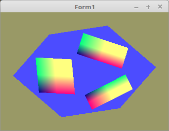

<!DOCTYPE html>
<html>
  <body bgcolor="#DDDDFF">
    <b><h1>25 - Framepuffer</h1></b>
    <b><h2>00 - In Textur rendern</h2></b>
  
Eine Scene kann man auch in eine Textur rendern, anstelle des Bildschirmes. 
Man kann dies auch gebrauchen, wen man eine Scene bei einem Autorennen in einen Rückspiegel rendern will. 

 
Deklaration der Vertexkonstanten des Quadrates, welches in die Textur gerendert wird. 
Es ist ein Quadrat mit 4 verschieden farbigen Ecken. 
<pre><code>const

  // --- Vectoren
  QuadVertex: array[0..1] of Tmat3x3 =
    (((-0.3, 0.3, 0.0), (-0.3, -0.3, 0.0), (0.3, -0.3, 0.0)), ((-0.3, 0.3, 0.0), (0.3, -0.3, 0.0), (0.3, 0.3, 0.0)));

  // --- Farben
  QuadColor: array[0..1] of Tmat3x3 =
    (((0.0, 2.0, 0.5), (0.0, 0.0, 0.5), (2.0, 0.0, 0.5)), ((0.0, 2.0, 0.5), (2.0, 0.0, 0.5), (2.0, 2.0, 0.5)));</pre></code>
Koordinanten des Würfels, auf dem die Texturen abgebidet werden, auf dem ein drehendes Rechteck abgebildet ist. 
Der Würfel braucht Texturkoordinaten. 
<pre><code>const

  // --- Vectoren
  CubeVertex: array[0..11] of Tmat3x3 =
    (((-0.5, 0.5, 0.5), (-0.5, -0.5, 0.5), (0.5, -0.5, 0.5)), ((-0.5, 0.5, 0.5), (0.5, -0.5, 0.5), (0.5, 0.5, 0.5)),
    ((0.5, 0.5, 0.5), (0.5, -0.5, 0.5), (0.5, -0.5, -0.5)), ((0.5, 0.5, 0.5), (0.5, -0.5, -0.5), (0.5, 0.5, -0.5)),
    ((0.5, 0.5, -0.5), (0.5, -0.5, -0.5), (-0.5, -0.5, -0.5)), ((0.5, 0.5, -0.5), (-0.5, -0.5, -0.5), (-0.5, 0.5, -0.5)),
    ((-0.5, 0.5, -0.5), (-0.5, -0.5, -0.5), (-0.5, -0.5, 0.5)), ((-0.5, 0.5, -0.5), (-0.5, -0.5, 0.5), (-0.5, 0.5, 0.5)),
    // oben
    ((0.5, 0.5, 0.5), (0.5, 0.5, -0.5), (-0.5, 0.5, -0.5)), ((0.5, 0.5, 0.5), (-0.5, 0.5, -0.5), (-0.5, 0.5, 0.5)),
    // unten
    ((-0.5, -0.5, 0.5), (-0.5, -0.5, -0.5), (0.5, -0.5, -0.5)), ((-0.5, -0.5, 0.5), (0.5, -0.5, -0.5), (0.5, -0.5, 0.5)));

  // --- Texturkoordinaten
  CubeTextureVertex: array[0..11] of Tmat3x2 =
    (((0.0, 1.0), (0.0, 0.0), (1.0, 0.0)), ((0.0, 1.0), (1.0, 0.0), (1.0, 1.0)),
    ((0.0, 1.0), (0.0, 0.0), (1.0, 0.0)), ((0.0, 1.0), (1.0, 0.0), (1.0, 1.0)),
    ((0.0, 1.0), (0.0, 0.0), (1.0, 0.0)), ((0.0, 1.0), (1.0, 0.0), (1.0, 1.0)),
    ((0.0, 1.0), (0.0, 0.0), (1.0, 0.0)), ((0.0, 1.0), (1.0, 0.0), (1.0, 1.0)),
    ((0.0, 1.0), (0.0, 0.0), (1.0, 0.0)), ((0.0, 1.0), (1.0, 0.0), (1.0, 1.0)),
    ((0.0, 1.0), (0.0, 0.0), (1.0, 0.0)), ((0.0, 1.0), (1.0, 0.0), (1.0, 1.0)));</pre></code>
Grösse der Textur, auf welcher das Quadrat gerendert wird. 
<pre><code>const
  TexturSize = 2048;</pre></code>
Das es 2 Scenen und Meshes gibt, werden die Vectorbuffer und die Matrix für die Bewegung doppelt gebraucht. 
Beim Quadrat wird der 2. VBO für die Farben gebraucht, beim Würfel für die Texturkoordinaten. 
<pre><code>var
  // ID der Textur.
  textureID: GLuint;

  // Renderpuffer
  FramebufferName, depthrenderbuffer: GLuint;</pre></code>
Erzeugen der Puffer, Shader und Matrizen, eigentlich nichts besonderes. 
<pre><code>procedure TForm1.CreateScene;
begin

  // Vertex Puffer erzeugen.
  glGenVertexArrays(1, @VBQuad.VAO);
  glGenBuffers(1, @VBQuad.VBOVertex);
  glGenBuffers(1, @VBQuad.VBOTex_Col);

  glGenVertexArrays(1, @VBCube.VAO);
  glGenBuffers(1, @VBCube.VBOVertex);
  glGenBuffers(1, @VBCube.VBOTex_Col);

  // Shader des Quadrates
  with Quad_Shader do begin
    Shader := TShader.Create([FileToStr('quad.vert'), FileToStr('quad.frag')]);
    with Shader do begin
      UseProgram;

      WorldMatrix_id := UniformLocation('Matrix');
    end;
  end;

  // Shader des Würfels.
  with Cube_Shader do begin
    Shader := TShader.Create([FileToStr('cube.vert'), FileToStr('cube.frag')]);
    with Shader do begin
      UseProgram;
      glUniform1i(UniformLocation('Sampler0'), 0);

      WorldMatrix_id := UniformLocation('Matrix');
    end;
  end;

  CubeWorldMatrix.Identity;
  QuadWorldMatrix.Identity;
end;</pre></code>
Die Vertexkoordinaten laden, auch nichts besonderes. 
<pre><code>procedure TForm1.InitScene;
begin
  glEnable(GL_DEPTH_TEST);
  glDepthFunc(GL_LESS);

  glEnable(GL_CULL_FACE);
  glCullface(GL_BACK);

  QuadWorldMatrix.Scale(2.0);

  // --- Quadrat
  with Quad_Shader do begin
    glBindVertexArray(VBQuad.VAO);

    // Vertexkoordinaten
    glBindBuffer(GL_ARRAY_BUFFER, VBQuad.VBOVertex);
    glBufferData(GL_ARRAY_BUFFER, sizeof(QuadVertex), @QuadVertex, GL_STATIC_DRAW);
    glEnableVertexAttribArray(0);
    glVertexAttribPointer(0, 3, GL_FLOAT, False, 0, nil);

    // Farben
    glBindBuffer(GL_ARRAY_BUFFER, VBQuad.VBOTex_Col);
    glBufferData(GL_ARRAY_BUFFER, sizeof(QuadColor), @QuadColor, GL_STATIC_DRAW);
    glEnableVertexAttribArray(1);
    glVertexAttribPointer(1, 3, GL_FLOAT, False, 0, nil);
  end;

  // --- Würfel
  with Cube_Shader do begin
    glBindVertexArray(VBCube.VAO);

    // Vertexkoordinaten
    glBindBuffer(GL_ARRAY_BUFFER, VBCube.VBOVertex);
    glBufferData(GL_ARRAY_BUFFER, sizeof(CubeVertex), @CubeVertex, GL_STATIC_DRAW);
    glEnableVertexAttribArray(0);
    glVertexAttribPointer(0, 3, GL_FLOAT, False, 0, nil);

    // Texturkoordinaten
    glBindBuffer(GL_ARRAY_BUFFER, VBCube.VBOTex_Col);
    glBufferData(GL_ARRAY_BUFFER, sizeof(CubeTextureVertex), @CubeTextureVertex, GL_STATIC_DRAW);
    glEnableVertexAttribArray(10);
    glVertexAttribPointer(10, 2, GL_FLOAT, False, 0, nil);
  end;</pre></code>
Das erzeugen der Textur ist sehr ähnlich einer normalen Textur, der grosse Unterschied, anstelle eines Pointer auf die Texturdaten, 
gibt man nur <b>nil</b> mit, da man nur einee leere Textur braucht. 
<pre><code>
  // ------------ Texturen erzeugenn --------------

  // --- Textur

  glGenTextures(1, @textureID);
  glBindTexture(GL_TEXTURE_2D, textureID);

  glTexImage2D(GL_TEXTURE_2D, 0, GL_RGBA, TexturSize, TexturSize, 0, GL_RGBA, GL_UNSIGNED_BYTE, nil);

  glTexParameteri(GL_TEXTURE_2D, GL_TEXTURE_MAG_FILTER, GL_NEAREST);
  glTexParameteri(GL_TEXTURE_2D, GL_TEXTURE_MIN_FILTER, GL_NEAREST);
</pre></code>
Hier wird die Textur mit dem Render/FrameBuffer gekoppelt. 
<pre><code>
  // Frame Puffer erzeugen.
  glGenFramebuffers(1, @FramebufferName);
  glBindFramebuffer(GL_FRAMEBUFFER, FramebufferName);

  // Render Puffer erzeugen.
  glGenRenderbuffers(1, @depthrenderbuffer);
  glBindRenderbuffer(GL_RENDERBUFFER, depthrenderbuffer);

  glRenderbufferStorage(GL_RENDERBUFFER, GL_DEPTH_COMPONENT, TexturSize, TexturSize);
  glFramebufferRenderbuffer(GL_FRAMEBUFFER, GL_DEPTH_ATTACHMENT, GL_RENDERBUFFER, depthrenderbuffer);

  // Die Textur mit dem Framebuffer koppeln
  glFramebufferTexture(GL_FRAMEBUFFER, GL_COLOR_ATTACHMENT0, textureID, 0);
end;</pre></code>
Hier sieht man wie zuerst in den Framebuffer gerendert wird, und anschiessend normal in den Bildschirmpuffer. 
Das Rendern läuft fast gleich ab, egal in welchen Puffer gerendert wird. 
Der einzige markante Unterschied, beim Bildschirmpuffer muss man am Ende <b>SwapBuffers</b> ausführen. 
Noch ein Hinweis, bei FramePuffer, ist der 4. Parameter von <b>glClearColor(...</b> relevant. 
Wen Alphablending aktiviert ist, kann der Hintergrund des Framepuffer auch transparent sein. 
Beim Bildschirmpuffer hat dieser keinen Einfluss. 
<pre><code>procedure TForm1.ogcDrawScene(Sender: TObject);
begin

  // --- In den Texturpuffer render.

  with Quad_Shader do begin // Quadrat

    // FramePuffer aktivieren.
    glBindFramebuffer(GL_FRAMEBUFFER, FramebufferName);

    glClearColor(0.3, 0.3, 1.0, 1.0);
    glClear(GL_COLOR_BUFFER_BIT or GL_DEPTH_BUFFER_BIT);
    glViewport(0, 0, TexturSize, TexturSize);

    Shader.UseProgram;
    glBindVertexArray(VBQuad.VAO);

    QuadWorldMatrix.Uniform(WorldMatrix_id);
    glDrawArrays(GL_TRIANGLES, 0, Length(QuadVertex) * 3);
  end;

  //  --- Normal auf den Bildschirm rendern.

  with Cube_Shader do begin  // Würfel

    // BildschirmPuffer mit "0" aktivieren.
    glBindFramebuffer(GL_FRAMEBUFFER, 0);

    glClearColor(0.6, 0.6, 0.4, 1.0);
    glClear(GL_COLOR_BUFFER_BIT or GL_DEPTH_BUFFER_BIT);
    glViewport(0, 0, ClientWidth, ClientHeight);

    glBindTexture(GL_TEXTURE_2D, textureID);

    Shader.UseProgram;
    glBindVertexArray(VBCube.VAO);

    CubeWorldMatrix.Uniform(WorldMatrix_id);
    glDrawArrays(GL_TriangleS, 0, Length(CubeVertex) * 3);

    ogc.SwapBuffers;
  end;

end;</pre></code>
Zum Schluss alle Puffer frei geben. 
<pre><code>procedure TForm1.FormDestroy(Sender: TObject);
begin
  Timer1.Enabled := False;

  // Frame Puffer und Textur frei geben.
  glDeleteFramebuffers(1, @FramebufferName);
  glDeleteRenderbuffers(1, @depthrenderbuffer);
  glDeleteTextures(1, @textureID);

  // Vertex Puffer frei geben.
  glDeleteVertexArrays(1, @VBQuad.VAO);
  glDeleteBuffers(1, @VBQuad.VBOVertex);
  glDeleteBuffers(1, @VBQuad.VBOTex_Col);

  glDeleteVertexArrays(1, @VBCube.VAO);
  glDeleteBuffers(1, @VBCube.VBOVertex);
  glDeleteBuffers(1, @VBCube.VBOTex_Col);

  // Shader frei geben.
  Quad_Shader.Shader.Free;
  Cube_Shader.Shader.Free;
end;</pre></code>

 
Die Shader sind sehr einfach, der Shader des Quadrates muss nur ein farbige Polygone ausgeben. 
Der Shader des Würfels, gibt Texturen aus. 
 
<b>Vertex-Shader Quadrat:</b> 
 
<pre><code>#version 330

layout (location = 0) in vec3 inPos;
layout (location = 10) in vec2 vertexUV0;

uniform mat4 Matrix;

out vec2 UV0;

void main(void)
{
  gl_Position = Matrix * vec4(inPos, 1.0);
  UV0 = vertexUV0;
}

</pre></code>

 
<b>Fragment-Shader Quadrat:</b> 
 
<pre><code>#version 330

in vec2 UV0;

uniform sampler2D Sampler0;

out vec4 FragColor;

void main()
{
  FragColor = texture( Sampler0, UV0 );
}
</pre></code>

 
<b>Vertex-Shader Würfel:</b> 
 
<pre><code>#version 330

layout (location = 0) in vec3 inPos;
layout (location = 1) in vec3 inCol;

uniform mat4 Matrix;

out vec3 Col;

void main(void)
{
  gl_Position = Matrix * vec4(inPos, 1.0);
  Col = inCol;
}
</pre></code>

 
<b>Fragment-Shader Würfel:</b> 
 
<pre><code>#version 330

in vec3 Col;
out vec4 outColor; // ausgegebene Farbe

void main(void)
{
  outColor = vec4(Col, 1.0);
}
</pre></code>

       
<h2><a href="../../index.html">zurück</a></h2>
  </body>
</html>
