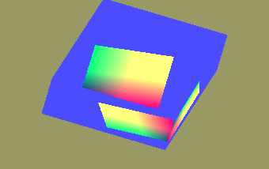

<!DOCTYPE html>
<html>
  <body bgcolor="#DDDDFF">
    <b><h1>25 - Framepuffer</h1></b>
    <b><h2>05 - Framepuffer speichern</h2></b>
  
Wen man in eine Textur rendert, hat man die Möglichkeit, den Inhalt der Textur in eine Datei zu speichern. 

 
Die Textur, in dem die Scene gerendert wurde, kann man auch abspeichern. 
Hinweis: Das Bild kann evtl. fehlerhaft abgespeichert werden, da dies OS abhängig ist. 
Dieser Code wurde unter Linux 64Bit getestet. 
Die <b>TBitmap</b> muss 32Bit sein, 24Bit wird nicht unterstützt. 
<pre><code>procedure TForm1.ButtonTexturSaveClick(Sender: TObject);
var
  Picture: TPicture;
begin
  Picture := TPicture.Create;
  with Picture.Bitmap do begin
    PixelFormat := pf32bit;  // 32-Bit erzwingen
    Width := TexturSize;
    Height := TexturSize;
    glBindFramebuffer(GL_FRAMEBUFFER, FramebufferName);
    glReadPixels(0, 0, TexturSize, TexturSize, GL_RGBA, GL_UNSIGNED_BYTE, RawImage.Data);
  end;
  Picture.SaveToFile('textur.png');
  Picture.Free;
end;</pre></code>
Es ist auch möglich, die komplett gerenderte Scene zu speichern. 
Leider steht das Bild auf dem Kopf. Die Ursache ist, bei einer Bitmap ist der Nullpunkt links-oben, bei OpenGL links/unten. 
Dies kann man aber umgehen, wen man Zeile für Zeile einliest. 
<b>glBindFramebuffer(GL_FRAMEBUFFER, 0);</b> ist nur notwendig, wen man mehrere Framebuffer verwendet. 
<pre><code>procedure TForm1.ButtonScreenSaveClick(Sender: TObject);
var
  Picture: TPicture;
  i: integer;
begin
  Picture := TPicture.Create;
  with Picture.Bitmap do begin
    PixelFormat := pf32bit;               // 32-Bit erzwingen
    Width := ogc.Width;
    Height := ogc.Height;
    glBindFramebuffer(GL_FRAMEBUFFER, 0); // Screen

    for i := 0 to Height - 1 do begin
      glReadPixels(0, Height - i - 1, Width, Height - i, GL_RGBA, GL_UNSIGNED_BYTE, ScanLine[i]);
    end;
  end;
  Picture.SaveToFile('screen.png');
  Picture.Free;
end;</pre></code>

 
Die Shader sind sehr einfach, der Shader des Quadrates muss nur ein farbige Polygone ausgeben. 
Der Shader des Würfels, gibt Texturen aus. 
 
<b>Vertex-Shader Quadrat:</b> 
 
<pre><code>#version 330

layout (location =  0) in vec3 inPos;
layout (location = 10) in vec2 vertexUV0;

uniform mat4 Matrix;

out vec2 UV0;

void main(void)
{
  gl_Position = Matrix * vec4(inPos, 1.0);
  UV0 = vertexUV0;
}

</pre></code>

 
<b>Fragment-Shader Quadrat:</b> 
 
<pre><code>#version 330

in vec2 UV0;

uniform sampler2D Sampler0;

out vec4 FragColor;

void main()
{
  FragColor = texture( Sampler0, UV0 );
}
</pre></code>

 
<b>Vertex-Shader Würfel:</b> 
 
<pre><code>#version 330

layout (location = 0) in vec3 inPos;
layout (location = 1) in vec3 inCol;

uniform mat4 Matrix;

out vec3 Col;

void main(void)
{
  gl_Position = Matrix * vec4(inPos, 1.0);
  Col = inCol;
}
</pre></code>

 
<b>Fragment-Shader Würfel:</b> 
 
<pre><code>#version 330

in vec3 Col;
out vec4 outColor; // ausgegebene Farbe

void main(void)
{
  outColor = vec4(Col, 1.0);
}
</pre></code>

       
<h2><a href="../../index.html">zurück</a></h2>
  </body>
</html>
