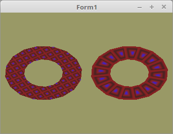

<html>
    <b><h1>35 - Geometrie-Shader</h1></b>
    <b><h2>00 - Breite Linien</h2></b>
  
Dieses Beispiel zeigt, wie sich Textur-Koordinaten auf die Textur auswirken. 
Bei der linken Textur, entsprechen die Textur-Koordinaten, denen der Vektoren, dies gibt ein Matrix ähnliches Muster, ausser das sie skaliert wird. 
Rechts ist jede Koordinate von 0.0-1.0, somit wird die Textur um die Scheibe gezogen. Jedes Rechteck enthält die ganze Textur. 

 
Hier sieht man gut, das die Textur-Koordinaten verschieden Werte bekommen. 
<pre><code=pascal><b>procedure</b> TForm1.CalcCircle;
<b>const</b>
  Sektoren = 7;
  maxSek = Sektoren * 8;
  r = 1.6 / maxSek;
<b>var</b>
  i: integer;
<b>begin</b>
  SetLength(Linies, maxSek);
  SetLength(Linies_Prev, maxSek);
  SetLength(Linies_Next, maxSek);
  <b>for</b> i := 0 <b>to</b> maxSek - 1 <b>do</b> <b>begin</b>
    Linies[i, 0] := sin(Pi * 2 / Sektoren * i) * r * i;
    Linies[i, 1] := cos(Pi * 2 / Sektoren * i) * r * i;
  <b>end</b>;
 
  Linies_Prev[0] := vec2(0.0, 0.0);
  <b>for</b> i := 1 <b>to</b> maxSek - 1 <b>do</b> <b>begin</b>
    Linies_Prev[i] := Linies[i - 1];
  <b>end</b>;
 
  Linies_Next[maxSek - 1] := vec2(0.0, 0.0);
  <b>for</b> i := 0 <b>to</b> maxSek - 1 - 1 <b>do</b> <b>begin</b>
    Linies_Next[i] := Linies[i + 1];
  <b>end</b>;
 
<b>end</b>;</code></pre>
Vertex-Koordianten bekommen beide Meshes die gleichen, aber die Textur-Koordinaten weichen ab. 
<pre><code=pascal><b>procedure</b> TForm1.InitScene;
<b>begin</b>
  TextureBuffer.ActiveAndBind;
  glClearColor(0.6, 0.6, 0.4, 1.0);
 
  <i>// Ring Links</i>
  glBindVertexArray(VBRingL.VAO);
 
  glBindBuffer(GL_ARRAY_BUFFER, VBRingL.VBO.Vertex);
  glBufferData(GL_ARRAY_BUFFER, Length(Linies) * SizeOf(TVector2f), Pointer(Linies), GL_STATIC_DRAW);
  glEnableVertexAttribArray(0);
  glVertexAttribPointer(0, 2, GL_FLOAT, <b>False</b>, 0, <b>nil</b>);
 
  glBindBuffer(GL_ARRAY_BUFFER, VBRingL.VBO.Prev);
  glBufferData(GL_ARRAY_BUFFER, Length(Linies) * SizeOf(TVector2f), Pointer(Linies_Prev), GL_STATIC_DRAW);
  glEnableVertexAttribArray(1);
  glVertexAttribPointer(1, 2, GL_FLOAT, <b>False</b>, 0, <b>nil</b>);
 
  glBindBuffer(GL_ARRAY_BUFFER, VBRingL.VBO.Next);
  glBufferData(GL_ARRAY_BUFFER, Length(Linies) * SizeOf(TVector2f), Pointer(Linies_Next), GL_STATIC_DRAW);
  glEnableVertexAttribArray(2);
  glVertexAttribPointer(2, 2, GL_FLOAT, <b>False</b>, 0, <b>nil</b>);
<b>end</b>;</code></pre>
<pre><code=pascal><b>procedure</b> TForm1.ogcDrawScene(Sender: TObject);
<b>var</b>
  TempMatrix: TMatrix;
<b>begin</b>
  glClear(GL_COLOR_BUFFER_BIT);
 
  TextureBuffer.ActiveAndBind;
 
  Shader.UseProgram;
 
  ProdMatrix := ScaleMatrix * RotMatrix;
 
  <i>// Zeichne linke Scheibe</i>
  TempMatrix := ProdMatrix;
  <i>//  ProdMatrix.Translate(-0.5, 0.0, 0.0);</i>
  ProdMatrix.Uniform(Matrix_ID);
  ProdMatrix := TempMatrix;
 
  glBindVertexArray(VBRingL.VAO);
  glDrawArrays(GL_LINE_STRIP, 0, Length(Linies) <b>div</b> 2);
 
  ogc.SwapBuffers;
<b>end</b>;</code></pre>

 
<b>Vertex-Shader:</b> 
<pre><code><b>#version</b> 330
 
<b>layout</b> (location = 0) <b>in</b> <b>vec2</b> inPos;
<b>layout</b> (location = 1) <b>in</b> <b>vec2</b> inPrev;
<b>layout</b> (location = 2) <b>in</b> <b>vec2</b> inNext;
 
<b>uniform</b> <b>mat4</b> mat;
 
<b>out</b> <b>vec2</b> Prev;
<b>out</b> <b>vec2</b> Next;
 
<b>void</b> main(<b>void</b>)
{
<i>//  Prev = inPrev;</i>
<i>///  Next = inNext;</i>
 
  Prev = (mat * <b>vec4</b>(inPrev, 0.0, 1.0)).xy;
  Next = (mat * <b>vec4</b>(inNext, 0.0, 1.0)).xy;
 
  gl_Position = mat * <b>vec4</b>(inPos, 0.0, 1.0);
}
</code></pre>

 
<b>Fragment-Shader:</b> 
<pre><code><b>#version</b> 330
 
<b>uniform</b> <b>sampler2D</b> Sampler;              <i>// Der Sampler welchem 0 zugeordnet wird.</i>
 
<b>in</b> <b>vec3</b> Color;
 
<b>out</b> <b>vec4</b> FragColor;
 
<b>void</b> main()
{
<i>//  FragColor = texture( Sampler, UV0 );  // Die Farbe aus der Textur anhand der Koordinten auslesen.</i>
  FragColor = <b>vec4</b>(Color, 1.0);
}
</code></pre>

 
<b>muster.xpm:</b> 
<pre><code>/* XPM */
static char *XPM_mauer[] = {
  "8 8 3 1",
  "  c #882222",
  "* c #442222",
  "+ c #4422BB",
  "        ",
  " ****** ",
  " *    * ",
  " * ++ * ",
  " * ++ * ",
  " *    * ",
  " ****** ",
  "        "
};
</code></pre>
 
</html>
