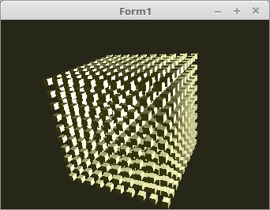

<!DOCTYPE html>
<html>
  <body bgcolor="#DDDDFF">
    <b><h1>50 - Instancing</h1></b>
    <b><h2>00 - Einfachste Instance</h2></b>
  
Mit <b>Instancing</b> hat man die Möglichkeit die Mesh mit <b>einem<b> glDraw... Aufruf mehrmals zu zeichnen. 
Bei dieser regelmässigen Anordnung ist dies sehr einfach. 
Man hat aber auch bei <b>Instancing</b> die Möglichkeit die Meshes X-beliebig anzuordnen. 
Dies wird in den nächsten Themen behandelt. 

 
Das Zeichnen ist sehr einfach und übersichtlich geworden. 
Es braucht <b>keine</b> for-to-Schleifen für die Cube-Array, dieser Teile erledigt alles der Vertex-Shader. 
Die Matrix muss nur <b>einmal</b> berechnet werden, da es nur <b>einen</b> Aufruf von <b>glDraw...</b> gibt. 
<pre><code>procedure TForm1.ogcDrawScene(Sender: TObject);
const
  s = 10;            // Eine Seite hat 10 Würfel.
  size = s * s * s;
begin
  glClear(GL_COLOR_BUFFER_BIT or GL_DEPTH_BUFFER_BIT);

  glEnable(GL_CULL_FACE);
  glCullface(GL_BACK);

  Shader.UseProgram;

  glBindVertexArray(VBCube.VAO);

  // Die Matrizen werden nur einmal berechnet.
  Matrix.Identity;
  Matrix.Scale(6.0);
  Matrix := ModelMatrix * Matrix;
  Matrix.Uniform(ModelMatrix_ID);
  Matrix := FrustumMatrix * WorldMatrix * Matrix;
  Matrix.Uniform(Matrix_ID);

  // glDraw... muss nur einmal aufgerufen werden.
  glDrawArraysInstanced(GL_TRIANGLES, 0, Length(CubeVertex) * 3, size);

  ogc.SwapBuffers;
end;</pre></code>
Das grosse Arbeit bei Instancing leistet der Vertex-Shader. 
 
<b>Vertex-Shader:</b> 
<pre><code>#version 330

#define size 10

layout (location = 0) in vec3 inPos;    // Vertex-Koordinaten
layout (location = 1) in vec3 inNormal; // Normale

// Daten für Fragment-shader
out Data {
  vec3 pos;
  vec3 Normal;
} DataOut;

uniform mat4 ModelMatrix;
uniform mat4 Matrix;

void main(void) {
  vec3 p = inPos / 2 - size / 2;
  p.x += gl_InstanceID % size;
  p.y += gl_InstanceID / size % size;
  p.z += gl_InstanceID / size /size;

  gl_Position    = Matrix * vec4(p, 1.0);

  DataOut.Normal = mat3(ModelMatrix) * inNormal;
  DataOut.pos    = (ModelMatrix * vec4(p, 1.0)).xyz;
}
</pre></code>

 
<b>Fragment-Shader</b> 
<pre><code>#version 330

#define LightPos vec3(50.0, 10.0, 50.0)
#define Diffuse  vec3( 1.0,  1.0,  0.9)

// Daten vom Vertex-Shader
in Data {
  vec3 pos;
  vec3 Normal;
} DataIn;

out vec4 outColor;

float light(vec3 p, vec3 n) {
  vec3 v1 = normalize(p);
  vec3 v2 = normalize(n);
  float d = dot(v1, v2);
  return clamp(d, 0.0, 1.0);
}

void main(void)
{
  outColor      = vec4(vec3(0.2, 0.2, 0.05), 1.0);
  outColor.rgb += vec3(light(LightPos - DataIn.pos, DataIn.Normal)) * Diffuse;
}
</pre></code>

       
<h2><a href="../../index.html">zurück</a></h2>
  </body>
</html>
