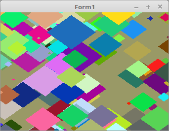

<html>
  
Man kann für jede Instance einen eigenen Uniform-Wert zu ordnen. Dafür packt man die Uniform-Werte in ein Array, 
welches >= anzahl Instancen ist. 
 
Dieses Verfahren hat zwei Nachteile. 
1. Man muss die Anzahl Intancen von Anfang an wissen. 
2. Die Anzahl Uniform-Werte ist begrenzt, bei diesem Beispiel und einem Intel4000 ist bei gut 800 Instancen Schluss. 
 
Diese Nachteile kann man umgehen, wen man anstelle von Uniformen VertexAttrib verwendet, dazu im nächasten Thema. 

 
Die Anzahl Instance 
<pre><code><b>const</b>
  InstanceCount = 200;</pre></code>
Die Deklaration, der Paramter für die einzelnen Instancen. 
Die Size könnte man mit der Matrix kombinieren, aber hier geht es um die Funktionsweise der Uniform-Übergaben. 
<pre><code><b>var</b>
  Matrix_ID, Color_ID, Size_ID: GLint;

  VBQuad: TVB;

  Data: <b>record</b>
    Size: <b>array</b>[0..InstanceCount - 1] <b>of</b> GLfloat;
    Matrix: <b>array</b>[0..InstanceCount - 1] <b>of</b> TMatrix;
    Color: <b>array</b>[0..InstanceCount - 1] <b>of</b> TVector3f;
  <b>end</b>;</pre></code>
Das Auslesen der UniformID. Dies geschieht gleich wie bei einfachen Uniformen. 
Die Instancen-Parameter mit zufälligen Werten belegen. 
<pre><code><b>procedure</b> TForm1.CreateScene;
<b>var</b>
  i: integer;
<b>begin</b>
  Shader := TShader.Create([FileToStr('Vertexshader.glsl'), FileToStr('Fragmentshader.glsl')]);
  Shader.UseProgram;
  Size_ID := Shader.UniformLocation('Size');
  Matrix_ID := Shader.UniformLocation('mat');
  Color_ID := Shader.UniformLocation('Color');

  glGenVertexArrays(1, @VBQuad.VAO);

  glGenBuffers(1, @VBQuad.VBO);

  <b>for</b> i := 0 <b>to</b> Length(Data.Matrix) - 1 <b>do</b> <b>begin</b>
    Data.Size[i] := Random() * 20 + 1.0;
    Data.Matrix[i].Identity;
    Data.Matrix[i].Translate(1.5 - Random * 3.0, 1.5- Random * 3.0, 0.0);
    Data.Color[i] := vec3(Random, Random, Random);
  <b>end</b>;
<b>end</b>;</pre></code>
Die Übergabe der Uniform-Werte. Da es sich um Arrays handelt, muss man noch die Länge der Array übergeben. 
Auch sieht man gut, das mal <b>glDrawArraysInstanced(...</b> nur einmal aufrufen muss. 
Würde man dies ohne Instancen lössen, müsste man die Uniformübergabe und glDraw... 200x aufrufen. 
Da sieht man den Vorteil, es ist viel weniger Kominikation mit der Grafikkarte nötig. 
<pre><code><b>procedure</b> TForm1.ogcDrawScene(Sender: TObject);
<b>begin</b>
  glClear(GL_COLOR_BUFFER_BIT);
  Shader.UseProgram;

  glBindVertexArray(VBQuad.VAO);

  glUniform1fv(Size_ID, InstanceCount, @Data.Size);
  glUniformMatrix4fv(Matrix_ID, InstanceCount, <b>False</b>, @Data.Matrix);
  glUniform3fv(Color_ID, InstanceCount, @Data.Color);
  glDrawArraysInstanced(GL_TRIANGLES, 0, Length(Quad) * 3, InstanceCount);

  ogc.SwapBuffers;
<b>end</b>;</pre></code>
Die Matrizen drehen. 
Dies muss man 200x machen, aber es sind nicht 200 Übergaben zur Grafikkarte nötig. 
<pre><code><b>procedure</b> TForm1.Timer1Timer(Sender: TObject);
<b>var</b>
  i: integer;
<b>begin</b>
  <b>for</b> i := 0 <b>to</b> Length(Data.Matrix) - 1 <b>do</b> <b>begin</b>
    Data.Matrix[i].RotateC(0.02);
  <b>end</b>;

  ogcDrawScene(Sender);  <i>// Neu zeichnen</i>
<b>end</b>;</pre></code>

 
<b>Vertex-Shader:</b> 
Hier sieht man, das mit <b>gl_InstanceID</b> auf die eizelnen Array-Elemente zugegriffen wird. 
<pre><code><b>#version</b> 330

<b>#define</b> Instance_Count 200

<b>layout</b> (location = 0) <b>in</b> <b>vec2</b> inPos;

<b>uniform</b> <b>float</b> Size[Instance_Count];
<b>uniform</b> <b>mat4</b> mat[Instance_Count];
<b>uniform</b> <b>vec3</b> Color[Instance_Count];

<b>out</b> <b>vec3</b> col;

<b>void</b> main(<b>void</b>)
{
  gl_Position = mat[gl_InstanceID] * <b>vec4</b>((inPos * Size[gl_InstanceID]), 0.0, 1.0);

  col = Color[gl_InstanceID];
}
</pre></code>

 
<b>Fragment-Shader:</b> 
<pre><code><b>#version</b> 330

<b>out</b> <b>vec4</b> outColor;   <i>// ausgegebene Farbe</i>

<b>in</b> <b>vec3</b> col;

<b>void</b> main(<b>void</b>)
{
  outColor = <b>vec4</b>(col, 1.0);
}
</pre></code>

</html>
