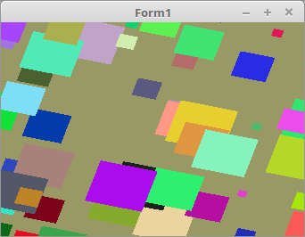

<!DOCTYPE html>
<html>
    <b><h1>50 - Instancing</h1></b>
    <b><h2>15 - Instancen nur in einer Array</h2></b>
  
Vorher hatte es für jedes Instance-Attribut eine eigene Array gehabt. 
Jetzt sind alle Attribute in einer Array, dies macht den Code einiges übersichtlicher. 
Dafür ist die Übergabe mit <b>glVertexAttribPointer(...</b> ein wenig komplizierter. 
Siehe [[Lazarus - OpenGL 3.3 Tutorial - Vertex-Puffer - Nur eine Array]]. 

 
Die Deklaration der Array. Es ist nur noch eine Array. 
<pre><code><b>type</b>
  TData = <b>record</b>
    Scale: GLfloat;
    Matrix: TMatrix;
    Color: TVector3f;
  <b>end</b>;

<b>var</b>
  Data: <b>array</b>[0..InstanceCount - 1] <b>of</b> TData;</pre></code>
Das es ein wenig einfacher wird, habe ich <b>ofs</b> verwendet. 
<pre><code><b>procedure</b> TForm1.InitScene;
<b>var</b>
  ofs, i: integer;
<b>begin</b>
  glClearColor(0.6, 0.6, 0.4, 1.0); <i>// Hintergrundfarbe</i>

  glBindVertexArray(VBQuad.VAO);

  <i>// --- Normale Vektordaten</i>
  <i>// Daten für Vektoren</i>
  glBindBuffer(GL_ARRAY_BUFFER, VBQuad.VBO.Vertex);
  glBufferData(GL_ARRAY_BUFFER, sizeof(Quad), @Quad, GL_STATIC_DRAW);
  glEnableVertexAttribArray(0);
  glVertexAttribPointer(0, 2, GL_FLOAT, <b>False</b>, 0, <b>nil</b>);

  <i>// --- Instancen</i>
  ofs := 0;
  glBindBuffer(GL_ARRAY_BUFFER, VBQuad.VBO.Instance);
  glBufferData(GL_ARRAY_BUFFER, SizeOf(Data), @Data, GL_STATIC_DRAW);

  <i>// Instance Size</i>
  glEnableVertexAttribArray(1);
  glVertexAttribPointer(1, 1, GL_FLOAT, <b>False</b>, SizeOf(TData), <b>nil</b>);
  glVertexAttribDivisor(1, 1);
  Inc(ofs, SizeOf(GLfloat));

  <i>// Instance Matrix</i>
  <b>for</b> i := 0 <b>to</b> 3 <b>do</b> <b>begin</b>
    glEnableVertexAttribArray(i + 2);
    glVertexAttribPointer(i + 2, 4, GL_FLOAT, <b>False</b>, SizeOf(TData), Pointer(ofs));
    glVertexAttribDivisor(i + 2, 1);
    Inc(ofs, SizeOf(TVector4f));
  <b>end</b>;

  <i>// Instance Color</i>
  glEnableVertexAttribArray(6);
  glVertexAttribPointer(6, 3, GL_FLOAT, <b>False</b>, SizeOf(TData), Pointer(ofs));
  glVertexAttribDivisor(6, 1);
<b>end</b>;</pre></code>
An der Zeichenroutine ändert sich nichts. 
<pre><code><b>procedure</b> TForm1.ogcDrawScene(Sender: TObject);
<b>begin</b>
  glClear(GL_COLOR_BUFFER_BIT);
  Shader.UseProgram;

  glBindVertexArray(VBQuad.VAO);

  glBindBuffer(GL_ARRAY_BUFFER, VBQuad.VBO.Instance);
  glBufferSubData(GL_ARRAY_BUFFER, 0, SizeOf(Data), @Data);

  glDrawArraysInstanced(GL_TRIANGLES, 0, Length(Quad) * 3, InstanceCount);

  ogc.SwapBuffers;
<b>end</b>;</pre></code>
Matrizen neu berechnen. 
<pre><code><b>procedure</b> TForm1.Timer1Timer(Sender: TObject);
<b>var</b>
  i: integer;
<b>begin</b>
  <b>for</b> i := 0 <b>to</b> Length(Data) - 1 <b>do</b> <b>begin</b>
    Data[i].Matrix.RotateC(0.02);
  <b>end</b>;

  ogcDrawScene(Sender);  <i>// Neu zeichnen</i>
<b>end</b>;</pre></code>

 
<b>Vertex-Shader:</b> 
Am Shader hat sich nichts geändert. 
<pre><code><b>#version</b> 330

<b>#define</b> Instance_Count 200

<i>// Vektor-Daten</i>
<b>layout</b> (location = 0) <b>in</b> <b>vec2</b> inPos;

<i>// Instancen</i>
<b>layout</b> (location = 1) <b>in</b> <b>float</b> Size;
<b>layout</b> (location = 2) <b>in</b> <b>mat4</b> mat;
<b>layout</b> (location = 6) <b>in</b> <b>vec3</b> Color;

<b>out</b> <b>vec3</b> col;

<b>void</b> main(<b>void</b>)
{
  gl_Position = mat * <b>vec4</b>((inPos * Size), 0.0, 1.0);

  col = Color;
}
</pre></code>

 
<b>Fragment-Shader:</b> 
<pre><code><b>#version</b> 330

<b>out</b> <b>vec4</b> outColor;   <i>// ausgegebene Farbe</i>

<b>in</b> <b>vec3</b> col;

<b>void</b> main(<b>void</b>)
{
  outColor = <b>vec4</b>(col, 1.0);
}
</pre></code>

</html>
