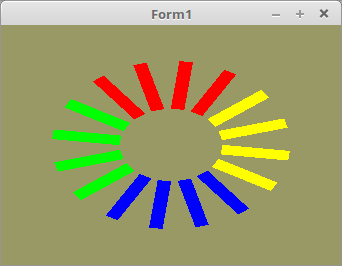

    <b><h1>50 - Instancing</h1></b>
    <b><h2>20 - VertexAttribDivisor</h2></b>
  
Mit <b>VertexAttribDivisor</b> kann man nicht nur bestimmen, das es sich im ein Instance-Attribut handelt. 
Man kann auch festlegen, das ein Attribut-Wert mehrmals verwendet wird, bevor er um eins weiter springt. 
Im Beispiel sieht man, das der Farb-Wert vier mal verwendet wird, bevor der nächste wert kommt. 

 
Für die Farben werden nur 4 Werte benötigt. Diese werden als Konstante deklariert, 
da diese sich zur Laufzeit nicht mehr ändern. 
<pre><code><b>const</b>
  Quad: <b>array</b>[0..1] <b>of</b> TFace3D =
    (((-0.8, -0.8, 0.0), (-0.8, 0.8, 0.0), (0.8, 0.8, 0.0)),
    ((-0.8, -0.8, 0.0), (0.8, -0.8, 0.0), (0.8, 0.8, 0.0)));

  Instance_Color: <b>array</b>[0..3] <b>of</b> TVector3f =
    ((1.0, 0.0, 0.0), (0.0, 1.0, 0.0), (0.0, 0.0, 1.0), (1.0, 1.0, 0.0));</pre></code>
Rechtecke gibt es 16 Stück, die Matrizen dafür sind dynamisch. 
<pre><code><b>var</b>
  Instance_Matrix: <b>array</b>[0..15] <b>of</b> TMatrix;</pre></code>
Mit <b>glVertexAttribDivisor(...</b> kann man nicht nur bestimmen, das es sich um ein Instance-Attribut handelt. 
Sondern man kann auch sagen wie viel mal ein Attribut-Wert verwendet wird. 
Dies geschieht mit dem zweiten Parameter. 
<pre><code><b>procedure</b> TForm1.InitScene;
<b>var</b>
  i: integer;
<b>begin</b>
  glClearColor(0.6, 0.6, 0.4, 1.0); <i>// Hintergrundfarbe</i>

  glBindVertexArray(VBTriangle.VAO);

  <i>// Vektor</i>
  glBindBuffer(GL_ARRAY_BUFFER, VBTriangle.VBO.Pos);
  glBufferData(GL_ARRAY_BUFFER, SizeOf(Quad), @Quad, GL_STATIC_DRAW);
  glEnableVertexAttribArray(0);
  glVertexAttribPointer(0, 3, GL_FLOAT, <b>False</b>, 0, <b>nil</b>);
  glVertexAttribDivisor(0, 0);

  <i>// Instance Color</i>
  glBindBuffer(GL_ARRAY_BUFFER, VBTriangle.VBO.iColor);
  glBufferData(GL_ARRAY_BUFFER, SizeOf(Instance_Color), @Instance_Color, GL_STATIC_DRAW);
  glEnableVertexAttribArray(1);
  glVertexAttribPointer(1, 3, GL_FLOAT, <b>False</b>, 0, <b>nil</b>);
  glVertexAttribDivisor(1, 4); <i>// Wert 4x verwenden.</i>

  <i>// Instance Matrix</i>
  glBindBuffer(GL_ARRAY_BUFFER, VBTriangle.VBO.iMatrix);
  glBufferData(GL_ARRAY_BUFFER, SizeOf(TMatrix) * Length(Instance_Matrix), <b>nil</b>, GL_STATIC_DRAW);
  <b>for</b> i := 0 <b>to</b> 3 <b>do</b> <b>begin</b>
    glEnableVertexAttribArray(i + 2);
    glVertexAttribPointer(i + 2, 4, GL_FLOAT, <b>False</b>, SizeOf(TMatrix), Pointer(i * 16));
    glVertexAttribDivisor(i + 2, 1); <i>// Wert 1x verwenden.</i>
  <b>end</b>;
<b>end</b>;</pre></code>
Matrizen drehen und anschliessend, neu laden. 
<pre><code><b>procedure</b> TForm1.Timer1Timer(Sender: TObject);
<b>const</b>
  r: GLfloat = 0.0;
<b>var</b>
  i: integer;
<b>begin</b>
  r += 0.01;
  <b>if</b> r > 2 * pi <b>then</b> <b>begin</b>
    r -= 2 * pi;
  <b>end</b>;

  <b>for</b> i := 0 <b>to</b> 15 <b>do</b> <b>begin</b>
    Instance_Matrix[i].Identity;
    Instance_Matrix[i].Scale(0.25, 0.05, 1.0);
    Instance_Matrix[i].RotateC(Pi * 2 / 16 * i + r);
    Instance_Matrix[i].TranslateLocalspace(2.0, 0.0, 0.0);
  <b>end</b>;

  glBindVertexArray(VBTriangle.VAO);

  glBindBuffer(GL_ARRAY_BUFFER, VBTriangle.VBO.iMatrix);
  glBufferSubData(GL_ARRAY_BUFFER, 0, SizeOf(TMatrix) * Length(Instance_Matrix), @Instance_Matrix);

  ogc.Invalidate;
<b>end</b>;</pre></code>

 
<b>Vertex-Shader:</b> 
<pre><code><b>#version</b> 330

<b>layout</b> (location = 0) <b>in</b> <b>vec3</b> position;
<b>layout</b> (location = 1) <b>in</b> <b>vec3</b> instance_color;
<b>layout</b> (location = 2) <b>in</b> <b>mat4</b> instance_Matrix;

<b>out</b> <b>vec4</b> Color;

<b>void</b> main(<b>void</b>) {
  gl_Position = instance_Matrix * <b>vec4</b>(position, 1.0);
  Color       = <b>vec4</b>(instance_color, 1.0);
}

</pre></code>

 
<b>Fragment-Shader</b> 
<pre><code><b>#version</b> 330

<b>in</b>  <b>vec4</b> Color;      <i>// interpolierte Farbe vom Vertexshader</i>
<b>out</b> <b>vec4</b> outColor;  <i>// ausgegebene Farbe</i>

<b>void</b> main(<b>void</b>)
{
  outColor = Color; <i>// Die Ausgabe der Farbe</i>
}
</pre></code>

