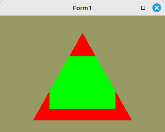

# 60 - Stencil
## 05 - Stencil einfach

Einfacher Stecil Buffer
**Wichtig** dabei, bei der Context-Erzeugung muss mitgeteilt werden, dan man Stencil verwenden will.
Ich habe dies bei der unit olgContext.pas eingebaut.

---

