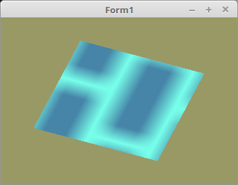

# 60 - Stencil
## 10 - Stencil Spielgelung




---

---
**Vertex-Shader:**

```glsl
#version 330 core

layout (location = 0) in vec3 inPos;
layout (location = 1) in vec3 inNorm;
layout (location = 2) in vec2 inTexCoord;

out vec4 vColor;
out vec2 vTexcoord;
out vec3 vNorm;

layout (std140) uniform UBO {
  vec4 color;
  mat4 proj;
  mat4 view;
  mat4 model;
};

void main()
{
  vColor = color;
  vNorm = (model * vec4(inNorm, 1)).xyz;
  vTexcoord = inTexCoord;
  gl_Position = proj * view * model * vec4(inPos, 1.0);
};

```


---
**Fragment-Shader:**

```glsl
#version 330 core

#define LightPos0 vec3(1.0, 1.0, -1.0)
#define LightPos1 vec3(-1.0, 1.0, 0.0)
#define ambient0 1.4
#define ambient1 0.2

in vec4 vColor;
in vec3 vNorm;
in vec2 vTexcoord;

out vec4 outColor;

uniform sampler2D Sampler;

float light(vec3 p, vec3 n) {
  vec3  v1 = normalize(p);
  vec3  v2 = normalize(n);
  float d  = dot(v1, v2);
  float c  = clamp(d, 0.0, 1.0);
  return c;
}

void main()
{
  float l0 = light(LightPos0, vNorm) * ambient0;
  float l1 = light(LightPos1, vNorm) * ambient1;

  vec4 col = vColor *  texture(Sampler, vTexcoord) * (l0 + l1) ;
  outColor = vec4(col);
};


```


