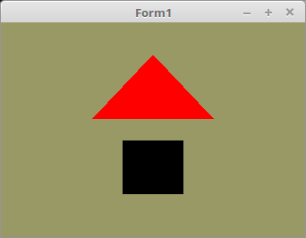

<!DOCTYPE html>
<html>
  <head>
    <meta charset="utf-8">
    <title>25 - Schleifen</title>
    
  </head>
  <body bgcolor="#DDDDFF">
    <b><h1>02 - Shader</h1></b>
    <b><h2>25 - Schleifen</h2></b>
  
In GLSL gibt es auch Schleifen, im Beispiel wird eine <b>if-else</b>-Schleife gezeigt, welche die Mesh Rot oder Schwarz darstellt. 
Es gibt auch <b>for</b> und <b>while-do</b>-Schleifen. 
<b>case</b>-Verzweigungen gibt es auch, eigentlich alle, welche es in C++ auch gibt. 

 
Für die <b>if</b>-Abfrage im Beispiel wird ein Boolean verwendet, man kann aber auch Integer, Float, etc. verwenden. 
Der ID, ist es egal, um welchen Unifom-Variablentyp es sich handelt, aus diesem Grund ist sie immer ein GLint. 
<pre><code><b>var</b>
  rot_ID: GLint;      <i>// ID für uniform "rot"</i></pre></code>
Der Location-Abfrage ist es gleich, was für ein Variablen-Typ die Uniform ist. 
Das Ermitteln geht bei allen Typen gleich. 
<pre><code><b>procedure</b> TForm1.CreateScene;
<b>begin</b>
  Shader := TShader.Create([FileToStr('Vertexshader.glsl'), FileToStr('Fragmentshader.glsl')]);
  Shader.UseProgram;
  rot_ID := Shader.UniformLocation('rot'); <i>// Ermittelt die ID von "rot".</i></pre></code>
Mit <b>glUniform1i(...</b> wird der Boolean übergeben. 
Ein Boolean, muss man als Integer übergeben. 
<pre><code><b>procedure</b> TForm1.ogcDrawScene(Sender: TObject);
<b>begin</b>
  glClear(GL_COLOR_BUFFER_BIT);
  Shader.UseProgram;

  <i>// Zeichne Dreieck</i>
  glUniform1i(rot_ID, GLint(<b>True</b>));   <i>// True = rot</i>
  glBindVertexArray(VBTriangle.VAO);
  glDrawArrays(GL_TRIANGLES, 0, Length(Triangle) * 3);

  <i>// Zeichne Quadrat</i>
  glUniform1i(rot_ID, GLint(<b>False</b>));  <i>// False = schwarz</i>
  glBindVertexArray(VBQuad.VAO);
  glDrawArrays(GL_TRIANGLES, 0, Length(Quad) * 3);

  ogc.SwapBuffers;
<b>end</b>;</pre></code>

 
<b>Vertex-Shader:</b> 
<pre><code><b>#version</b> 330

<b>layout</b> (location = 10) <b>in</b> <b>vec3</b> inPos; <i>// Vertex-Koordinaten</i>
 
<b>void</b> main(<b>void</b>)
{
  gl_Position = <b>vec4</b>(inPos, 1.0);
}
</pre></code>

 
<b>Fragment-Shader:</b> 
 
Mit der Uniform-Variable "rot" wird ermittelt, ob die Mesh Rot oder schwarz ist. 
Die Auswertung erfolgt über eine if-else-Schleife. 
<pre><code><b>#version</b> 330

<b>uniform</b> <b>bool</b> rot;   <i>// Ist es "rot" ?</i>
<b>out</b> <b>vec4</b> outColor;  <i>// ausgegebene Farbe</i>

<b>void</b> main(<b>void</b>)
{
  <i>// Die if-Abfrage</i>
  <b>if</b> (rot) {
    outColor = <b>vec4</b>(1.0, 0.0, 0.0, 1.0); <i>// Rot</i>
  } <b>else</b> {
    outColor = <b>vec4</b>(0.0, 0.0, 0.0, 1.0); <i>// Schwarz</i>
  }
}
</pre></code>

       
<h2><a href="../../index.html">zurück</a></h2>
  </body>
</html>
