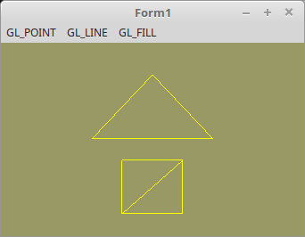

# 01 - Einrichten und Einstieg
## 20 - Polygonmodus



Standartmässig stellt OpenGL Polygone flächenfüllend dar.
Man kann aber die Polygone auch als Drahtgitter, oder nur die Eckpunkte als Punkte darstellen.

Dies kann man mit **glPolygonMode(...** einstellen.
Der Modus **GL_LINE** ist recht praktisch, wen man eine Mesh in der Entwicklungphase rendert, so kann man recht gut Renderfehler erkennen.

Hinweis: Hier wird die TShader-Klasse verwendet, näheres dazu im Kapitel Shader.

---
Hier werden die verschiedenen Polygone-Modis eingestellt.
Mit **glPolygonMode(...** und dem zweiten Parameter werden die verschiedenen Modis eingestellt.
Dabei muss der erste Paramter immer **GL_FRONT_AND_BACK** sein, die beiden Parameter **GL_FRONT** und **GL_BACK** gehen mit OpenGL >= 3.3 nicht mehr.
**glPolygonMode(...** kann auch bei DrawScene aufgerufen werden. ZB. wen man zwei Meshes hat, kann man die einte Fächenfüllend und die andere als Drahtgitter darstellen.

```pascal
procedure TForm1.MenuItemClick(Sender: TObject);
begin
  case TMainMenu(Sender).Tag of
    1: begin
      glPolygonMode(GL_FRONT_AND_BACK, GL_POINT);  // Punkte
    end;
    2: begin
      glPolygonMode(GL_FRONT_AND_BACK, GL_LINE);   // Linien
    end;
    3: begin
      glPolygonMode(GL_FRONT_AND_BACK, GL_FILL);   // Flächenfüllend
    end;
  end;
  ogc.Invalidate;   // Manuelle Aufruf von DrawScene.
end;
```


---
Die Shader haben keinen Einfluss auf die Polygonmodis.
**Vertex-Shader:**

```glsl
#version 330
layout (location = 0) in vec3 inPos;  // Vertex-Koordinaten

void main(void)
{
  gl_Position = vec4(inPos, 1.0);
}

```


---
**Fragment-Shader:**

```glsl
#version 330

out vec4 outColor; // ausgegebene Farbe

void main(void)
{
  outColor = vec4(1.0, 1.0, 0.0, 1.0); // Gelb
}

```


