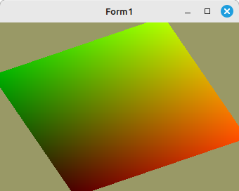

# 02 - Shader
## 40 - Koordinaten im ViewPort



Man kann im Fragment-Shader abfragen, auf welcher Koordinate im Viewport der aktuelle zu zeichnende Pixel ist.

---
**Vertex-Shader:**

```glsl
#version 330

layout (location = 10) in vec3 inPos;   // Vertex-Koordinaten

uniform mat4 mat;

void main(void) {
  gl_Position = mat * vec4(inPos, 1.0);
}

```


---
**Fragment-Shader:**

Farbenberechnung anhand der Koordinaten.

```glsl
#version 330

uniform ivec2 ScreenSize; // Die Grösse des Viewports

out vec4 outColor;

void main(void) {
  outColor.ba = vec2(0.0, 1.0);
  outColor.rg = 1.0 / ScreenSize * gl_FragCoord.xy;
}

```


