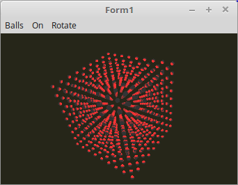

# 07 - Beleuchtung
## 20 - Point Light Kugel



In diesem Beispiel sieht man die Punkt-Beleuchtung gut, man kann beobachten, wie sich das Licht innerhalb der Kugeln bewegt.
Am besten man schaltet nur eine Lichtquelle ein.

Der Unterschied zum Directional-Light, man muss noch die Position des Vertex der Lichtposition abziehen.
Wen die Vertex-Position grösser als die Lichtposition ist, dann verschwindet der Vertex im Schatten und es wird dunkel.

---
Hier sieht man, das die Vertex-Position der Lichtposition abgezogen wird.

**Vertex-Shader:**

```glsl
#version 330

#define ambient vec3(0.2, 0.2, 0.2)
#define red     vec3(1.0, 0.0, 0.0)
#define green   vec3(0.0, 1.0, 0.0)
#define blue    vec3(0.0, 0.0, 1.0)

layout (location = 0) in vec3 inPos;    // Vertex-Koordinaten
layout (location = 1) in vec3 inNormal; // Normale

out vec4 Color;                         // Farbe, an Fragment-Shader übergeben.

uniform mat4 ModelMatrix;
uniform mat4 Matrix;                    // Matrix für die Drehbewegung und Frustum.

uniform bool RedOn;
uniform bool GreenOn;
uniform bool BlueOn;

uniform vec3 RedLightPos;
uniform vec3 GreenLightPos;
uniform vec3 BlueLightPos;

float light(vec3 p, vec3 n) {
  vec3 v1 = normalize(p);     // Vektoren normalisieren, so das die Länge des Vektors immer 1.0 ist.
  vec3 v2 = normalize(n);
  float d = dot(v1, v2);      // Skalarprodukt aus beiden Vektoren berechnen.
  return clamp(d, 0.0, 1.0);
}

void main(void) {
  gl_Position = Matrix * vec4(inPos, 1.0);

  vec3 Normal = mat3(ModelMatrix) * inNormal;
  vec3 pos    = (ModelMatrix * vec4(inPos, 1.0)).xyz;

  Color = vec4(ambient, 1.0);
  if (RedOn) {
    vec3 colRed = light(RedLightPos - pos, Normal) * red;
    Color.rgb += colRed;
  }
  if (GreenOn) {
    vec3 colGreen = light(GreenLightPos - pos, Normal) * green;
    Color.rgb += colGreen;
  }
  if (BlueOn) {
    vec3 colBlue = light(BlueLightPos- pos, Normal) * blue;
    Color.rgb += colBlue;
  }
}

```


---
**Fragment-Shader**

```glsl
#version 330

in  vec4 Color;     // interpolierte Farbe vom Vertexshader
out vec4 outColor;  // ausgegebene Farbe

void main(void) {
  outColor = Color; // Die Ausgabe der Farbe
}

```


