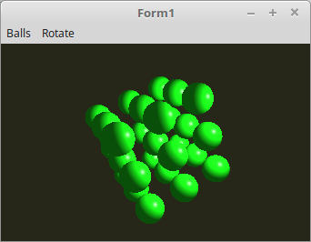

# 17 - Uniform Buffer Object (UBO)
## 10 - Mehrer UBO



Man kann auch von Anfang an, mehrere UBOs anlegen und somit kann man sehr schnell zwischen den Datenblöcken umschalten.

---
Es werden drei UBOs angelegt.
ID im Shader wird nur eine gebraucht.

```pascal
var
  UBO: record
    Rubin, Jade, Smaragdgruen: GLuint;        // Puffer-Zeiger
  end;
  Material_ID: GLint; // ID im Shader
```

Der BindingPoint muss global deklariert werden, da er fürs Binden im Timer auch gebraucht wird.

```pascal
var
  bindingPoint: gluint = 0;
```

ID und Puffer generieren.

```pascal
procedure TForm1.CreateScene;
begin
  with Shader do begin
    UseProgram;
    Matrix_ID := UniformLocation('Matrix');
    ModelMatrix_ID := UniformLocation('ModelMatrix');

    Material_ID := UniformBlockIndex('Material'); // ID aus dem Shader holen.
  end;

  glGenVertexArrays(1, @VBCube.VAO);

  glGenBuffers(1, @VBCube.VBOvert);
  glGenBuffers(1, @VBCube.VBONormal);

  glGenBuffers(3, @UBO);          // Die 3 UB0-Puffer generieren.
```

Material-Daten in den UBO-Puffer laden und binden.
Da die UBO-Daten im VRAM abgelegt sind, kann man gut für die verschiedenen Puffer einfach die Material-Daten überschreiben.
Dies ist gleich wie bei den Vertex-Pufferen.

```pascal
procedure TForm1.InitScene;
begin
  // Puffer für Rubin anlegen.
  with Material do begin
    ambient := vec3(0.17, 0.01, 0.01);
    diffuse := vec3(0.61, 0.04, 0.04);
    specular := vec3(0.73, 0.63, 0.63);
    shininess := 76.8;
  end;
  glBindBuffer(GL_UNIFORM_BUFFER, UBO.Rubin);
  glBufferData(GL_UNIFORM_BUFFER, sizeof(TMaterial), @Material, GL_DYNAMIC_DRAW);

  // Puffer für Jade anlegen.
  with Material do begin
    ambient := vec3(0.14, 0.22, 0.16);
    diffuse := vec3(0.54, 0.89, 0.63);
    specular := vec3(0.32, 0.32, 0.32);
    shininess := 12.8;
  end;
  glBindBuffer(GL_UNIFORM_BUFFER, UBO.Jade);
  glBufferData(GL_UNIFORM_BUFFER, sizeof(TMaterial), @Material, GL_DYNAMIC_DRAW);

  // Puffer für Smaragdgruen anlegen.
  with Material do begin
    ambient := vec3(0.02, 0.17, 0.02);
    diffuse := vec3(0.08, 0.81, 0.08);
    specular := vec3(0.63, 0.73, 0.63);
    shininess := 76.8;
  end;
  glBindBuffer(GL_UNIFORM_BUFFER, UBO.Smaragdgruen);
  glBufferData(GL_UNIFORM_BUFFER, sizeof(TMaterial), @Material, GL_DYNAMIC_DRAW);

  // Verbindung mit dem Shader aufbauen.
  glUniformBlockBinding(Shader.ID, Material_ID, bindingPoint);

  // Timer manuell aufrufen, so das die ersten Daten in den UBO-kopiert werden.
  Timer2Timer(nil);
```

Für die verscheidenen Materialien, wir einfach nur ein anderer UBO über den Bindingpoint mit dem Shader verbunden.

```pascal
procedure TForm1.Timer2Timer(Sender: TObject);
const
  m: integer = 0;
begin
    case m of
      0: begin
        glBindBufferBase(GL_UNIFORM_BUFFER, bindingPoint, UBO.Rubin);
      end;
      1: begin
        glBindBufferBase(GL_UNIFORM_BUFFER, bindingPoint, UBO.Jade);
      end;
      2: begin
        glBindBufferBase(GL_UNIFORM_BUFFER, bindingPoint, UBO.Smaragdgruen);
      end;
    end;

  Inc(m);
  if m > 2 then begin
    m := 0;
  end;
end;
```


---
Der Shader ist der selbe wie im ersten Beispiel.

**Vertex-Shader:**

```glsl
#version 330

layout (location = 0) in vec3 inPos;    // Vertex-Koordinaten
layout (location = 1) in vec3 inNormal; // Normale

// Daten für Fragment-shader
out Data {
  vec3 Pos;
  vec3 Normal;
} DataOut;

// Matrix des Modeles, ohne Frustum-Beeinflussung.
uniform mat4 ModelMatrix;

// Matrix für die Drehbewegung und Frustum.
uniform mat4 Matrix;

void main(void)
{
  gl_Position    = Matrix * vec4(inPos, 1.0);

  DataOut.Normal = mat3(ModelMatrix) * inNormal;
  DataOut.Pos    = (ModelMatrix * vec4(inPos, 1.0)).xyz;
}

```


---
**Fragment-Shader**

```glsl
#version 330

// Licht
#define Lposition  vec3(35.0, 17.5, 35.0)
#define Lambient   vec3(1.8, 1.8, 1.8)
#define Ldiffuse   vec3(1.5, 1.5, 1.5)

// Daten vom Vertex-Shader
in Data {
  vec3 Pos;
  vec3 Normal;
} DataIn;

layout (std140) uniform Material {
  vec3  Mambient;   // Umgebungslicht
  vec3  Mdiffuse;   // Farbe
  vec3  Mspecular;  // Spiegelnd
  float Mshininess; // Glanz
};

out vec4 outColor;

vec3 Light(in vec3 p, in vec3 n) {
  vec3 nn = normalize(n);
  vec3 np = normalize(p);
  vec3 diffuse;   // Licht
  vec3 specular;  // Reflektion
  float angele = max(dot(nn, np), 0.0);
  if (angele > 0.0) {
    vec3 eye = normalize(np + vec3(0.0, 0.0, 1.0));
    specular = pow(max(dot(eye, nn), 0.0), Mshininess) * Mspecular;
    diffuse  = angele * Mdiffuse * Ldiffuse;
  } else {
    specular = vec3(0.0);
    diffuse  = vec3(0.0);
  }
  return (Mambient * Lambient) + diffuse + specular;
}

void main(void)
{
  outColor = vec4(Light(Lposition - DataIn.Pos, DataIn.Normal), 1.0);
}


```


