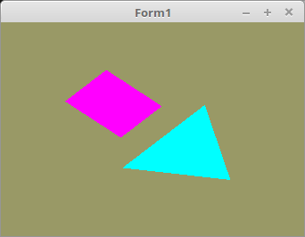

# 04 - Matrix
## 05 - Matrix Rotieren



Hier wird eine **4x4 Matrix** verwendet, dies ist Standard bei allen Mesh Translationen.
Im Timer wird eine Matrix-Rotation ausgeführt.
Für diese einfache Roatation, könnte man auch eine **2x2-Matrix** nehmen, aber sobald man die Mesh auch verschieben will, braucht man **4x4-Matrix**, auch wird es sonst komplizierter im Shader.

---
Hier wird ein Matrix4x4-Typ deklariert.
Für die Manipulationen einer Matrix eignet sich hervorragend ein **Type Helper**.

```pascal
type
  TMatrix = array[0..3, 0..3] of GLfloat;

  TMatrixfHelper = Type Helper for TMatrix
    procedure Identity;                  // Generiere eine Einheitsmatrix
    procedure Rotate(angele: single);   // Drehe Matrix
  end;
```

Die Matrix selbst, die rotiert wird.
Und die ID für den Shader.

```pascal
var
  MatrixRot: TMatrix;     // Matrix
  MatrixRot_ID: GLint;    // ID für Matrix.
```

Hier wird eine Einheits-Matrix erzeugt, bei einer 4x4-Matrix, sieht dies so aus:

|   |   |   |   |
|---|---|---|---|
| 1 | 0 | 0 | 0 |
| 0 | 1 | 0 | 0 |
| 0 | 0 | 1 | 0 |
| 0 | 0 | 0 | 1 |


```pascal
procedure TMatrixfHelper.Identity;
const
  MatrixIdentity: TMatrix = ((1.0, 0.0, 0.0, 0.0), (0.0, 1.0, 0.0, 0.0), (0.0, 0.0, 1.0, 0.0), (0.0, 0.0, 0.0, 1.0));
begin
  Self := MatrixIdentity;
end;
```

Mit dieser Procedure, wird die Matrix um die Z-Achse rotiert.
Der Winkel wird im **Bogenmass** angegeben.
Für nicht Mathematiker, **360°** sind **2⋅π** ( 2⋅Pi ).

```pascal
procedure TMatrixfHelper.Rotate(angele: single);
var
  i: integer;
  x, y: GLfloat;
begin
  for i := 0 to 1 do begin
    x := Self[i, 0];
    y := Self[i, 1];
    Self[i, 0] := x * cos(angele) - y * sin(angele);
    Self[i, 1] := x * sin(angele) + y * cos(angele);
  end;
end;

```

In diesem Code sind zwei Zeilen relevant, eine mit **UniformLocation** für die Matrix-ID.
In der anderen wird die Matrix, die gedreht wird, erst mal als Einheits-Matrix gesetzt.
Dies ist wichtig, ansonsten sieht man keine Mesh mehr, da diese unendlich klein skaliert wird.

```pascal
procedure TForm1.CreateScene;
begin
  Shader := TShader.Create([FileToStr('Vertexshader.glsl'), FileToStr('Fragmentshader.glsl')]);
  Shader.UseProgram;
  Color_ID := Shader.UniformLocation('Color');
  MatrixRot_ID := Shader.UniformLocation('mat'); // Ermittelt die ID von MatrixRot.
  MatrixRot.Identity;                             // MatrixRot auf Einheits-Matrix setzen.
```

Hier wird die Uniform-Variable **MatrixRot** dem Shader übergeben.
Mit **glUniform4fv(...** kann man eine **4x4 Matrix** dem Shader übergeben.
Für eine 2x2 Matrix wäre dies **glUniform2fv(...** und für die 3x3 **glUniform3fv(...**.

```pascal
procedure TForm1.ogcDrawScene(Sender: TObject);
begin
  glClear(GL_COLOR_BUFFER_BIT);
  Shader.UseProgram;
  glUniformMatrix4fv(MatrixRot_ID, 1, False, @MatrixRot); // MatrixRot in den Shader.
```

Die Drehung der Matrix wird fortlaufend um den Wert **step** gedreht.

```pascal
procedure TForm1.Timer1Timer(Sender: TObject);
const
  step: GLfloat = 0.01;          // Der Winkel ist im Bogenmass.
begin
  MatrixRot.Rotate(step);        // MatrixRot rotieren.
  ogcDrawScene(Sender);          // Neu zeichnen.
end;
```


---
**Vertex-Shader:**

Hier ist die Uniform-Variable **mat** hinzugekommen, dies ist auch eine 4x4-Matrix, so wie im Haupt-Programm.
Diese wird im Vertex-Shader deklariert, Bewegungen kommen immer in diesen Shader.

Man sieht dort auch gut, das die **Vektoren** mit dieser **Matrix** multipliziert werden.
Da diese Multiplikation im Shader ist, wird die Berechnung in der **GPU** ausgeführt, und somit wird die **CPU** entlastet.
Aus diesem Grund haben Gaming-Grafikkarten solch eine grosse Leistung.

```glsl
#version 330

layout (location = 10) in vec3 inPos;    // Vertex-Koordinaten
uniform mat4 mat;                        // Matrix von Uniform

void main(void)
{
  gl_Position = mat * vec4(inPos, 1.0);  // Vektoren mit der Matrix multiplizieren.
}

```


---
**Fragment-Shader:**

```glsl
#version 330

uniform vec3 Color;  // Farbe von Uniform
out vec4 outColor;   // ausgegebene Farbe

void main(void)
{
  outColor = vec4(Color, 1.0);
}

```


