# Lazarus - OpenGL 3.3 Tutorial
## Einleitung
Hinweis: Die Sourcen auf GitHub sind aktueller als das Wiki. 
Auch befinden sich Beispiele auf GitHub, welche im Wiki nicht dokumentiert sind. 
## Tutorial
## Einrichten und Einstieg
| Link | Beschreibung
| :---: | ---
| [Lazarus fuer OpenGL einrichten](01_-_Einrichten_und_Einstieg/00_-_Lazarus_fuer_OpenGL_einrichten/readme.md) | 
| [Context erzeugen](01_-_Einrichten_und_Einstieg/05_-_Context_erzeugen/readme.md) | 
| [VAO - Daten laden](01_-_Einrichten_und_Einstieg/10_-_VAO_-_Daten_laden/readme.md) | 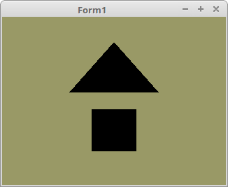
| [Erster Shader](01_-_Einrichten_und_Einstieg/15_-_Erster_Shader/readme.md) | 
| [Polygonmodus](01_-_Einrichten_und_Einstieg/20_-_Polygonmodus/readme.md) | 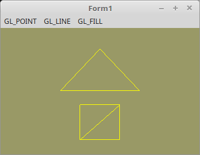
## Shader
| Link | Beschreibung
| :---: | ---
| [Einleitung und laden der Shader](02_-_Shader/00_-_Einleitung_und_laden_der_Shader/readme.md) | 
| [Einfachster Shader](02_-_Shader/05_-_Einfachster_Shader/readme.md) | 
| [Uniform Variablen](02_-_Shader/10_-_Uniform_Variablen/readme.md) | 
| [Erste Bewegung](02_-_Shader/15_-_Erste_Bewegung/readme.md) | 
| [Mehrere Shader](02_-_Shader/20_-_Mehrere_Shader/readme.md) | 
| [Schleifen](02_-_Shader/25_-_Schleifen/readme.md) | 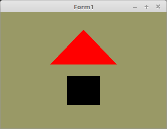
| [Geometrie Shader](02_-_Shader/30_-_Geometrie_Shader/readme.md) | 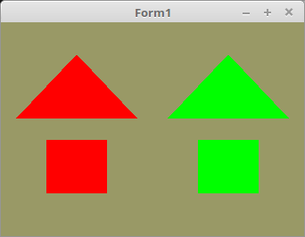
| [Punkte verschieden darstellen](02_-_Shader/35_-_Punkte_verschieden_darstellen/readme.md) | 
| [Shader Mandelbrot](02_-_Shader/40_-_Shader_Mandelbrot/readme.md) | 
| [Variablen Namen auslesen](02_-_Shader/45_-_Variablen_Namen_auslesen/readme.md) | 
## Vertex-Puffer
| Link | Beschreibung
| :---: | ---
| [Einfachster Vertex-Puffer](03_-_Vertex-Puffer/00_-_Einfachster_Vertex-Puffer/readme.md) | 
| [Mehrere Vertex-Puffer, Mehrarbige Mesh](03_-_Vertex-Puffer/05_-_Mehrere_Vertex-Puffer,_Mehrarbige_Mesh/readme.md) | 
| [Vertex-Puffer in 2D](03_-_Vertex-Puffer/10_-_Vertex-Puffer_in_2D/readme.md) | 
| [Nur eine Array](03_-_Vertex-Puffer/15_-_Nur_eine_Array/readme.md) | 
| [Vertex-Daten zur Laufzeit modifizieren](03_-_Vertex-Puffer/20_-_Vertex-Daten_zur_Laufzeit_modifizieren/readme.md) | 
| [Shapes (Dreiecke)](03_-_Vertex-Puffer/25_-_Shapes_(Dreiecke)/readme.md) | 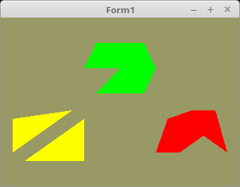
| [Shapes (Linien und Punkte)](03_-_Vertex-Puffer/30_-_Shapes_(Linien_und_Punkte)/readme.md) | 
| [DrawArrays](03_-_Vertex-Puffer/35_-_DrawArrays/readme.md) | 
| [Indices](03_-_Vertex-Puffer/40_-_Indices/readme.md) | 
| [Index-Puffer](03_-_Vertex-Puffer/45_-_Index-Puffer/readme.md) | 
| [Index-Puffer dynamisch](03_-_Vertex-Puffer/50_-_Index-Puffer_dynamisch/readme.md) | 
| [VertexID](03_-_Vertex-Puffer/55_-_VertexID/readme.md) | 
| [Vertex-Puffer auslesen](03_-_Vertex-Puffer/60_-_Vertex-Puffer_auslesen/readme.md) | 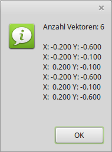
## Matrix
| Link | Beschreibung
| :---: | ---
| [Was ist eine Matrix](04_-_Matrix/00_-_Was_ist_eine_Matrix/readme.md) | 
| [Matrix Rotieren](04_-_Matrix/05_-_Matrix_Rotieren/readme.md) | 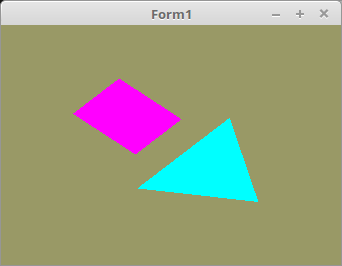
| [Matrix Verschieben und Multiplizieren](04_-_Matrix/10_-_Matrix_Verschieben_und_Multiplizieren/readme.md) | 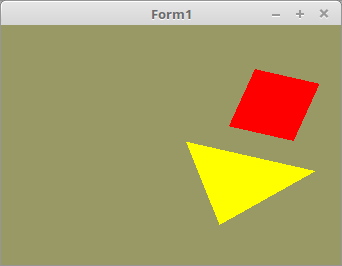
| [Kleines Planetarium](04_-_Matrix/15_-_Kleines_Planetarium/readme.md) | 
## 3D
| Link | Beschreibung
| :---: | ---
| [Erster-Wuerfel](05_-_3D/00_-_Erster-Wuerfel/readme.md) | 
| [Polygon - Seite (Backface Culling)](05_-_3D/05_-_Polygon_-_Seite_(Backface_Culling)/readme.md) | 
| [Tiefenbuffer](05_-_3D/10_-_Tiefenbuffer/readme.md) | 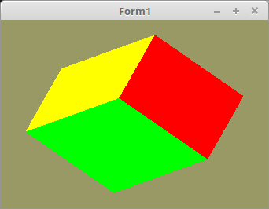
| [Orthogonalprojektion](05_-_3D/15_-_Orthogonalprojektion/readme.md) | 
| [Fluchtpunktperspektive (Frustum)](05_-_3D/20_-_Fluchtpunktperspektive_(Frustum)/readme.md) | 
| [Betrachtungs - Fenster (Viewport)](05_-_3D/25_-_Betrachtungs_-_Fenster_(Viewport)/readme.md) | 
## Alpha Blending
| Link | Beschreibung
| :---: | ---
| [Einfaches Alpha Blending](06_-_Alpha_Blending/00_-_Einfaches_Alpha_Blending/readme.md) | 
| [Die Reihenfolge ist wichtig](06_-_Alpha_Blending/05_-_Die_Reihenfolge_ist_wichtig/readme.md) | 
| [Reihenfolge sortiert mit Wuerfeln](06_-_Alpha_Blending/10_-_Reihenfolge_sortiert_mit_Wuerfeln/readme.md) | 
| [Reihenfolge sortiert mit Texturen](06_-_Alpha_Blending/15_-_Reihenfolge_sortiert_mit_Texturen/readme.md) | 
| [Alpha-Kanal abfragen und ingnorieren](06_-_Alpha_Blending/20_-_Alpha-Kanal_abfragen_und_ingnorieren/readme.md) | 
## Beleuchtung
| Link | Beschreibung
| :---: | ---
| [Einfache Beleuchtung](07_-_Beleuchtung/00_-_Einfache_Beleuchtung/readme.md) | 
| [Ambient Light](07_-_Beleuchtung/05_-_Ambient_Light/readme.md) | 
| [Directional Light](07_-_Beleuchtung/10_-_Directional_Light/readme.md) | 
| [Mehrere Directional Light Quellen](07_-_Beleuchtung/15_-_Mehrere_Directional_Light_Quellen/readme.md) | 
| [Point Light Kugel](07_-_Beleuchtung/20_-_Point_Light_Kugel/readme.md) | 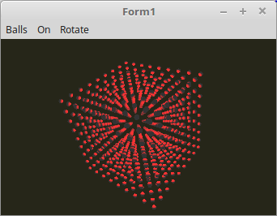
| [Point Light Vertex-Shader](07_-_Beleuchtung/25_-_Point_Light_Vertex-Shader/readme.md) | 
| [Point Light Fragment-Shader](07_-_Beleuchtung/30_-_Point_Light_Fragment-Shader/readme.md) | 
| [Grundlage Spot Licht](07_-_Beleuchtung/35_-_Grundlage_Spot_Licht/readme.md) | 
| [Spot Light, einfacher Kegel](07_-_Beleuchtung/40_-_Spot_Light,_einfacher_Kegel/readme.md) | 
| [Spot Light, mit Normale](07_-_Beleuchtung/45_-_Spot_Light,_mit_Normale/readme.md) | 
| [Spot Light, Abschwaechen](07_-_Beleuchtung/50_-_Spot_Light,_Abschwaechen/readme.md) | 
## Material Eigenschaften
| Link | Beschreibung
| :---: | ---
| [Material Directional Light](15_-_Material_Eigenschaften/00_-_Material_Directional_Light/readme.md) | 
| [Material Point Light](15_-_Material_Eigenschaften/05_-_Material_Point_Light/readme.md) | 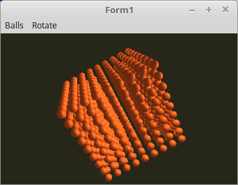
| [Material Spot Light](15_-_Material_Eigenschaften/10_-_Material_Spot_Light/readme.md) | 
## Bump Mapping
| Link | Beschreibung
| :---: | ---
| [Einfachstes Bump Mapping](16_-_Bump_Mapping/00_-_Einfachstes_Bump_Mapping/readme.md) | 
| [Bump Mapping](16_-_Bump_Mapping/05_-_Bump_Mapping/readme.md) | 
## Uniform Buffer Object (UBO)
| Link | Beschreibung
| :---: | ---
| [Einfacher UBO](17_-_Uniform_Buffer_Object_(UBO)/00_-_Einfacher_UBO/readme.md) | 
| [UBO Zur Laufzeit aktualisieren](17_-_Uniform_Buffer_Object_(UBO)/05_-_UBO_Zur_Laufzeit_aktualisieren/readme.md) | 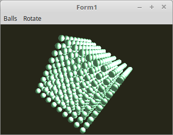
| [Mehrer UBO](17_-_Uniform_Buffer_Object_(UBO)/10_-_Mehrer_UBO/readme.md) | 
| [Mehrer Shader und BindingPoint](17_-_Uniform_Buffer_Object_(UBO)/15_-_Mehrer_Shader_und_BindingPoint/readme.md) | 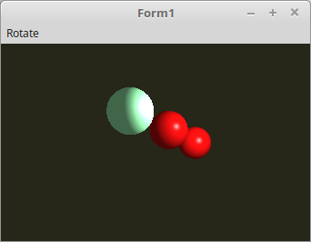
| [Mehrere UBOs in einem Shader](17_-_Uniform_Buffer_Object_(UBO)/20_-_Mehrere_UBOs_in_einem_Shader/readme.md) | 
## Texturen
| Link | Beschreibung
| :---: | ---
| [Erste Textur](20_-_Texturen/00_-_Erste_Textur/readme.md) | 
| [Mehrere Texturen](20_-_Texturen/05_-_Mehrere_Texturen/readme.md) | 
| [Texturn austauschen, Auschnitt laden](20_-_Texturen/10_-_Texturn_austauschen,_Auschnitt_laden/readme.md) | 
| [Texturen von BMP](20_-_Texturen/15_-_Texturen_von_BMP/readme.md) | 
| [Texturen mit oglTextur](20_-_Texturen/20_-_Texturen_mit_oglTextur/readme.md) | 
| [Texturen von XPM](20_-_Texturen/25_-_Texturen_von_XPM/readme.md) | 
| [Texturen und Matrixen](20_-_Texturen/30_-_Texturen_und_Matrixen/readme.md) | 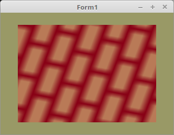
| [Multitexturing](20_-_Texturen/35_-_Multitexturing/readme.md) | 
| [Filter](20_-_Texturen/40_-_Filter/readme.md) | 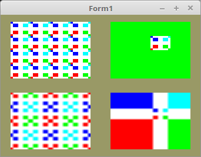
| [Alpha-Textur](20_-_Texturen/45_-_Alpha-Textur/readme.md) | 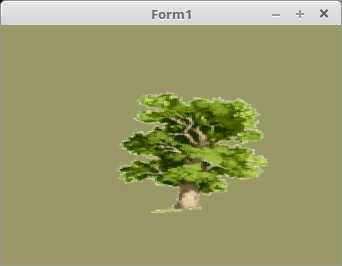
| [Textur-Koordinaten](20_-_Texturen/50_-_Textur-Koordinaten/readme.md) | 
| [Texturen Perspektiven-Korrektur](20_-_Texturen/55_-_Texturen_Perspektiven-Korrektur/readme.md) | 
| [1D Textur](20_-_Texturen/60_-_1D_Textur/readme.md) | 
| [Textur Array](20_-_Texturen/65_-_Textur_Array/readme.md) | 
| [Textur Array einzel Bitmap](20_-_Texturen/70_-_Textur_Array_einzel_Bitmap/readme.md) | 
## Cubemap Texturen
| Link | Beschreibung
| :---: | ---
| [Wuerfel](22_-_Cubemap_Texturen/00_-_Wuerfel/readme.md) | 
| [Umgebung](22_-_Cubemap_Texturen/05_-_Umgebung/readme.md) | 
| [Kugel](22_-_Cubemap_Texturen/10_-_Kugel/readme.md) | 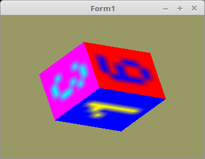
## Framepuffer
| Link | Beschreibung
| :---: | ---
| [In Textur rendern](25_-_Framepuffer/00_-_In_Textur_rendern/readme.md) | 
| [Framepuffer speichern](25_-_Framepuffer/05_-_Framepuffer_speichern/readme.md) | 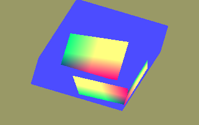
## Geometrie-Shader
| Link | Beschreibung
| :---: | ---
| [Breite Linien](35_-_Geometrie-Shader/00_-_Breite_Linien/readme.md) | 
| [GL TRIANGLE STRIP ADJACENCY](35_-_Geometrie-Shader/05_-_GL_TRIANGLE_STRIP_ADJACENCY/readme.md) | 
| [GL TRIANGLE STRIP ADJACENCY Soft linie](35_-_Geometrie-Shader/05_-_GL_TRIANGLE_STRIP_ADJACENCY_Soft_linie/readme.md) | 
## Schatten
| Link | Beschreibung
| :---: | ---
| [Eine einfache Mesh](45_-_Schatten/00_-_Eine_einfache_Mesh/readme.md) | 
## Instancing
| Link | Beschreibung
| :---: | ---
| [Einfachste Instance](50_-_Instancing/00_-_Einfachste_Instance/readme.md) | 
| [Instance mit Uniform](50_-_Instancing/05_-_Instance_mit_Uniform/readme.md) | 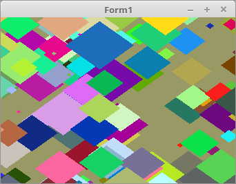
| [Instance mit VertexAttribut](50_-_Instancing/10_-_Instance_mit_VertexAttribut/readme.md) | 
| [Instancen nur in einer Array](50_-_Instancing/15_-_Instancen_nur_in_einer_Array/readme.md) | 
| [VertexAttribDivisor](50_-_Instancing/20_-_VertexAttribDivisor/readme.md) | 
## Vektoren und Matrizen ( no OpenGL )
| Link | Beschreibung
| :---: | ---
| [Einleitung Vektorgrafik](90_-_Vektoren_und_Matrizen_(_no_OpenGL_)/00_-_Einleitung_Vektorgrafik/readme.md) | 
| [Matrix 2D Demo](90_-_Vektoren_und_Matrizen_(_no_OpenGL_)/05_-_Matrix_2D_Demo/readme.md) | 
| [Vektoren Cube](90_-_Vektoren_und_Matrizen_(_no_OpenGL_)/10_-_Vektoren_Cube/readme.md) | 
| [Gradient Triangle](90_-_Vektoren_und_Matrizen_(_no_OpenGL_)/15_-_Gradient_Triangle/readme.md) | 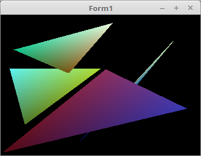
| [Vektoren Cube Z-Buffer](90_-_Vektoren_und_Matrizen_(_no_OpenGL_)/20_-_Vektoren_Cube_Z-Buffer/readme.md) | 
| [Vektoren Cube Texture](90_-_Vektoren_und_Matrizen_(_no_OpenGL_)/25_-_Vektoren_Cube_Texture/readme.md) | 
